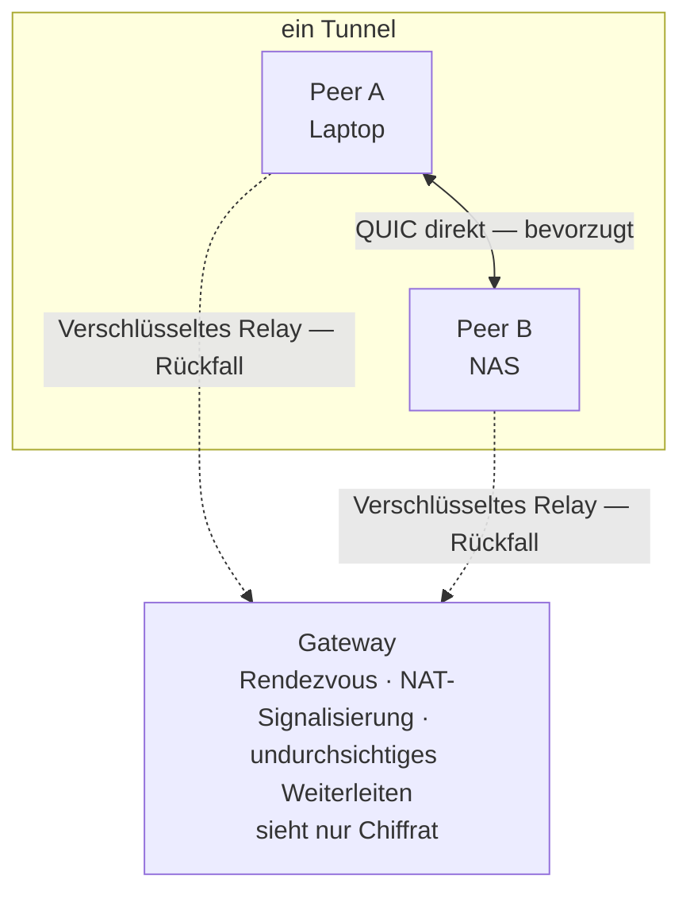

<h1 align="center">Lantunnel</h1>

<p align="center">
  <strong>Dein privates Netz — überall dort, wo du arbeitest.</strong><br>
  Erreiche Rechner und Dienste in deinen eigenen LANs von überall: bevorzugt direkt,
  Ende-zu-Ende verschlüsselt, ohne Portfreigaben und ohne öffentliche URLs.
</p>

<p align="center">
  <a href="https://github.com/lantunnel/lantunnel/actions/workflows/ci.yml"></a>
  <a href="https://lantunnel.app/"></a>
  <a href="./LICENSE"></a>
  
  
</p>

<p align="center">
  <a href="https://lantunnel.app/">Website</a> ·
  <a href="https://lantunnel.app/download">Download</a> ·
  <a href="./docs/USAGE.de.md">Anleitung</a> ·
  <a href="./CONTEXT.md">Architektur</a> ·
  <a href="./docs/PROTOCOL.md">Protokoll</a>
</p>

<p align="center">
  <a href="./README.md">English</a> ·
  <a href="./README.zh-CN.md">简体中文</a> ·
  <a href="./README.zh-TW.md">繁體中文</a> ·
  <a href="./README.ja.md">日本語</a> ·
  <a href="./README.es.md">Español</a> ·
  <b>Deutsch</b> ·
  <a href="./README.fr.md">Français</a>
</p>

---

Das NAS steht zu Hause. Die GPU-Maschine im Büro. Die `ollama`-Instanz auf dem Desktop, den du beim Rausgehen stehen gelassen hast. Alle hinter NAT — und keine davon gehört ins offene Internet.

Lantunnel fasst diese Rechner zu einem kleinen privaten Mesh zusammen — einem **Tunnel** —, dem nur beitreten kann, wem du ein Profil ausgestellt hast. Peers finden einander und sprechen **direkt** miteinander, wann immer das Netz es zulässt. Wenn nicht, greift ein **verschlüsseltes Relay** über ein Gateway, das Chiffrat weiterreicht, das es selbst nicht lesen kann. In beiden Fällen wird nichts veröffentlicht, kein Router-Port geöffnet und unterwegs nichts entschlüsselt.

> ### 🚀 Kein eigenes Gateway betreiben? Musst du nicht.
>
> **[lantunnel.app](https://lantunnel.app/)** gibt jedem Konto einen **dauerhaft kostenlosen Tunnel**: unbegrenzter Direktverkehr, beliebig viele LAN-Geräte hinter jedem Client und 5 GB verschlüsseltes Relay pro Monat für die Fälle, in denen die Direktverbindung nicht zustande kommt. Tunnel anlegen, Client herunterladen, Profil importieren — fertig. Kein Server, keine Zertifikate, kein DNS.
>
> Und wenn du das Gateway lieber selbst hosten willst: Das ist alles hier im Repository, Apache-2.0 lizenziert und ohne jede Volumenmessung.
>
> **[→ Kostenlosen Tunnel anlegen](https://lantunnel.app/)**

---

## Was du bekommst

| | |
|---|---|
| **Direkt zuerst** | Jeder neue Flow versucht zunächst eine direkte QUIC-Verbindung mit UDP-Hole-Punching. Das Relay ist der Rückfall, nicht der Normalfall. |
| **Ende-zu-Ende verschlüsselt** | Relay-Nutzdaten werden mit XChaCha20-Poly1305 versiegelt, mit Schlüsseln aus einem X25519-Austausch zwischen den beiden Peers. Das Gateway leitet Bytes weiter, die es nicht entschlüsseln kann. |
| **Keine Portfreigaben** | Peers wählen nach außen. Nichts in deinem LAN braucht eine eingehende Regel, eine öffentliche IP oder einen Hostnamen. |
| **Das ganze LAN erreichbar** | Ein Peer kann die privaten Subnetze veröffentlichen, in denen er steht. Ein einziger Client im Netz macht NAS, Drucker und internes Dashboard für den Rest des Tunnels erreichbar. |
| **Die Zugriffsregeln gehören dir** | Jeder Client entscheidet selbst, was er ausliefert. Die Richtlinie liegt auf der Zielmaschine — nie auf dem Gateway, nie auf einem Server. |
| **Eine Binary, mit oder ohne Oberfläche** | `lantunnel-client` öffnet standardmäßig ein Desktop-Fenster und führt mit `--headless` dieselbe Laufzeit auf einem Server aus. |
| **Überall** | macOS, Windows, Linux, Android und iOS. |

### Wofür Leute es tatsächlich einsetzen

- **Spiele- und Medien-Streaming** — Sunshine/Moonlight, Jellyfin oder Plex vom Rechner zu Hause.
- **Private KI und Entwicklerwerkzeuge** — Ollama, Open WebUI, eine interne API, eine Staging-Umgebung, eine Datenbank, die das LAN niemals verlassen darf.
- **Dienste zu Hause und im Büro** — NAS, Home Assistant, Kameras, interne Dashboards, SSH.

## Wie es funktioniert



Drei Bausteine — und das ist das ganze System:

- **`lantunnel-client`** läuft auf jedem teilnehmenden Gerät. Er importiert ein signiertes `.peer`-Profil, verbindet sich mit dem Gateway und stellt einen SOCKS5-Proxy auf Loopback bereit, dazu optional native Routen, damit gewöhnliche Anwendungen den Tunnel erreichen, ohne von ihm zu wissen.
- **`lantunnel-gateway`** ist Treffpunkt und Signalisierer für die NAT-Überwindung. Es lässt einen Tunnel zu, weil es dessen öffentliche `.scope`-Datei hält, hilft Peers beim Aufbau einer Direktverbindung und leitet versiegelte Bytes weiter, wenn das nicht klappt. Es hält keine privaten Peer-Schlüssel und sieht keinen Klartext.
- **`lantunnel-admin`** erstellt den Tunnel offline. Zwei Befehle: `init-tunnel` erzeugt die Besitzerdatei und den öffentlichen Scope fürs Gateway, `add-peer` stellt pro Gerät ein signiertes Profil aus. Es kommuniziert mit nichts.

Identität wird signiert, nicht geteilt. Es gibt kein Tunnel-Passwort, kein Gruppengeheimnis und kein Bearer-Token: Jeder Peer besitzt seinen eigenen Ed25519-Schlüssel, weist den Besitz bei jeder Verbindung nach — und dieser Schlüssel verlässt die erzeugende Maschine nie.

📖 **[Architektur und Konzepte →](./CONTEXT.md)**  ·  📐 **[Wire-Protokoll →](./docs/PROTOCOL.md)**

## Schnellstart

### Der schnelle Weg — gehostetes Gateway

1. Lege deinen kostenlosen Tunnel auf **[lantunnel.app](https://lantunnel.app/)** an.
2. Füge pro Gerät einen Peer hinzu und lade dessen `.peer`-Profil herunter.
3. Installiere den Client von **[lantunnel.app/download](https://lantunnel.app/download)** und importiere das Profil.

Das war's. Richte eine Anwendung auf `127.0.0.1:1080`, oder aktiviere natives Routing und nutze die LAN-Adressen direkt.

### Der eigene Weg — dein Gateway, deine Regeln

```bash
# 1. Tunnel offline anlegen. Dieser Schritt fasst das Netz nicht an.
lantunnel-admin init-tunnel \
  --gateway-transport quic \
  --gateway-host gw.example.com \
  --gateway-port 8443
#   → <tunnel-id>.tunnel   gut verwahren: der Signaturschlüssel des Tunnels
#   → <tunnel-id>.scope    öffentlich; mehr braucht das Gateway nicht

# 2. Pro Gerät ein Profil ausstellen.
lantunnel-admin add-peer --tunnel <tunnel-id>.tunnel --name laptop --output laptop.peer
lantunnel-admin add-peer --tunnel <tunnel-id>.tunnel --name nas    --output nas.peer

# 3. Öffentlichen Scope auf den Gateway-Host legen und starten.
mkdir -p state/scopes.d && cp <tunnel-id>.scope state/scopes.d/
lantunnel-gateway --config configs/gateway.yaml

# 4. Auf jedem Gerät das eigene Profil importieren und verbinden.
lantunnel-client tunnel import ./laptop.peer
lantunnel-client                          # Desktop-Oberfläche
lantunnel-client connect '<tunnel_id>'    # dieselbe Laufzeit, ohne Fenster
```

Ein Profil pro Gerät — ein `.peer` ist nicht zum Herumkopieren gedacht.

📘 **[Vollständige Anleitung — Installation, LAN-Freigabe, Zugriffsregeln, Server, Mobilgeräte, Fehlersuche →](./docs/USAGE.de.md)**

## Was in diesem Repository liegt

Alles, was du brauchst, um Lantunnel selbst zu betreiben — unter Apache-2.0:

| Pfad | Inhalt |
|---|---|
| `apps/lantunnel-client` | Der Client. Tauri-Desktopoberfläche und Headless-Laufzeit in einer Binary. |
| `apps/lantunnel-gateway` | Das Gateway. |
| `apps/lantunnel-admin` | Offline-Provisionierung: `init-tunnel`, `add-peer`. |
| `apps/android-proxy` | Android-App (VpnService). |
| `apps/ios-proxy` | iOS-App (NetworkExtension). |
| `crates/tp-*` | Gemeinsame Implementierung: Protokoll, Transporte, Proxies, P2P sowie Gateway- und Client-Engine. |
| `docs/PROTOCOL.md` | Normatives Wire-Format. |
| `CONTEXT.md` | Architektur und Begriffe. |
| `docs/USAGE.de.md` | Wie man es tatsächlich benutzt. |

Die gehostete Plattform unter lantunnel.app — Konten, Abrechnung, verwaltete Gateway-Flotte — ist ein eigenständiger Closed-Source-Dienst und **nicht** Teil dieses Repositories. Nichts hier hängt davon ab, und eine selbst gehostete Installation nimmt nie Kontakt dorthin auf.

## Aus dem Quellcode bauen

Erforderlich sind Rust 1.89 oder neuer, `protoc` für den gRPC-Transport und Node für das Client-Frontend.

```bash
# Gateway und Provisionierungswerkzeug
cargo build --release -p lantunnel-gateway
cargo build --release -p lantunnel-admin

# Client (zuerst das Frontend bauen)
npm --prefix apps/lantunnel-client/frontend ci
npm --prefix apps/lantunnel-client/frontend run build
cargo build --release -p lantunnel-client
```

Unter Linux linkt der Client gegen webkit2gtk, appindicator und rsvg; die genauen `-dev`-Pakete stehen in [`.github/workflows/ci.yml`](./.github/workflows/ci.yml).

Prüfungen, dazu eine Ende-zu-Ende-Abnahme mit drei Peers, die jedes gerichtete TCP- und UDP-Paar erst direkt und anschließend über verschlüsseltes Relay nachweist:

```bash
cargo fmt --all -- --check
cargo clippy --workspace --all-targets -- -D warnings
cargo test --workspace
tests/e2e/v2_docker/run.sh
```

## Kompatibilität

Peers, Gateways und Profile müssen aus derselben 2.0.x-Reihe stammen — das Wire-Format wird nicht zwischen Versionen ausgehandelt. Du kommst von einer 1.x-Installation? Deren Profile lassen sich nicht importieren; erzeuge mit `lantunnel-admin` neue.

## Mitwirken

Issues und Pull Requests sind willkommen — Hinweise zu Build, Tests und Stil stehen in [CONTRIBUTING.md](./CONTRIBUTING.md). Eine Schwachstelle gefunden? Bitte vertraulich gemäß [SECURITY.md](./SECURITY.md) melden, nicht in einem öffentlichen Issue.

## Lizenz

Apache License 2.0 — siehe [LICENSE](./LICENSE) und [NOTICE](./NOTICE).

---

> Dies ist die deutsche Fassung der [README.md](./README.md). Bei Abweichungen gilt die englische Fassung.

<p align="center">
  <strong>Spar dir das Aufsetzen.</strong> Ein dauerhaft kostenloser Tunnel, unbegrenzter Direktverkehr, verwaltete Gateways in Bereitschaft.<br>
  <a href="https://lantunnel.app/"><strong>Auf lantunnel.app loslegen →</strong></a>
</p>
