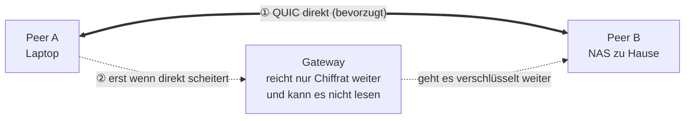

<h1 align="center">Lantunnel</h1>

<p align="center">
  <strong>Dein privates Netz — überall dort, wo du arbeitest.</strong><br>
  Erreiche Rechner und Dienste in deinen eigenen LANs von überall: bevorzugt direkt,
  Ende-zu-Ende verschlüsselt, ohne Portfreigaben und ohne öffentliche URLs.
</p>

<p align="center">
  <a href="https://github.com/lantunnel/lantunnel/actions/workflows/ci.yml"></a>
  <a href="https://lantunnel.app/"></a>
  <a href="./LICENSE"></a>
  
  
</p>

<p align="center">
  <a href="https://qm.qq.com/q/A5LX4uUwzC"></a>
  <a href="https://discord.gg/HsQK9cj2kh"></a>
</p>

<p align="center">
  <a href="https://buymeacoffee.com/buhuipao"></a>
</p>

<p align="center">
  <a href="https://lantunnel.app/">Website</a> ·
  <a href="https://lantunnel.app/download">Download</a> ·
  <a href="./docs/USAGE.de.md">Anleitung</a> ·
  <a href="./CONTEXT.md">Architektur</a> ·
  <a href="./docs/PROTOCOL.md">Protokoll</a>
</p>

<p align="center">
  <a href="./README.md">English</a> ·
  <a href="./README.zh-CN.md">简体中文</a> ·
  <a href="./README.zh-TW.md">繁體中文</a> ·
  <a href="./README.ja.md">日本語</a> ·
  <a href="./README.es.md">Español</a> ·
  <b>Deutsch</b> ·
  <a href="./README.fr.md">Français</a>
</p>

---

Das NAS steht zu Hause. Die GPU-Maschine im Büro. Die `ollama`-Instanz auf dem Desktop, den du beim Rausgehen stehen gelassen hast. Alle hinter NAT — und keine davon gehört ins offene Internet.

Lantunnel fasst diese Rechner zu einem kleinen privaten Mesh zusammen — einem **Tunnel** —, dem nur beitreten kann, wem du ein Profil ausgestellt hast. Peers finden einander und sprechen **direkt** miteinander, wann immer das Netz es zulässt. Wenn nicht, greift ein **verschlüsseltes Relay** über ein Gateway, das Chiffrat weiterreicht, das es selbst nicht lesen kann. In beiden Fällen wird nichts veröffentlicht, kein Router-Port geöffnet und unterwegs nichts entschlüsselt.

> ### 🚀 Kein eigenes Gateway betreiben? Musst du nicht.
>
> **[lantunnel.app](https://lantunnel.app/)** gibt jedem Konto einen **dauerhaft kostenlosen Tunnel**: unbegrenzter Direktverkehr, beliebig viele LAN-Geräte hinter jedem Client und 5 GB verschlüsseltes Relay pro Monat für die Fälle, in denen die Direktverbindung nicht zustande kommt. Tunnel anlegen, Client herunterladen, Profil importieren — fertig. Kein Server, keine Zertifikate, kein DNS.
>
> Und wenn du das Gateway lieber selbst hosten willst: Das ist alles hier im Repository, Apache-2.0 lizenziert und ohne jede Volumenmessung.
>
> **[→ Kostenlosen Tunnel anlegen](https://lantunnel.app/)**

---

<!-- lantunnel:toc -->
<a id="contents"></a>
## Inhalt

**Zum ersten Mal hier?** Geh direkt zum [Schnellstart](#quick-start). Dort stehen vier Wege, Lantunnel zu betreiben, sortiert nach Aufwand — und der erste sind drei Schritte ganz ohne Server.

- [Der Client](#the-client) — wie die App aussieht
- [Schnellstart](#quick-start) — **hier anfangen**
  - [1. Das Gateway der Platform nutzen](#mode-1) — *am einfachsten, nichts aufzusetzen*
  - [2. Dein Gateway, betrieben von der Platform](#mode-2)
  - [3. Alles selbst betreiben](#mode-3)
  - [4. Einem fremden Tunnel beitreten](#mode-4)
- [Was du bekommst](#what-you-get) · [Wofür Leute es tatsächlich einsetzen](#use-cases)
- [Wie es funktioniert](#how-it-works) — die drei Teile und warum zuerst direkt verbunden wird
- [Was in diesem Repository liegt](#whats-inside)
- [Aus dem Quellcode bauen](#building) · [Kompatibilität](#compatibility)
- [Verwandte Projekte](#related) · [Mitwirken](#contributing) · [Lizenz](#license)

**Tiefer einsteigen:** [Vollständige Anleitung](./docs/USAGE.de.md) · [Architektur und Begriffe](./CONTEXT.md) · [Wire-Protokoll](./docs/PROTOCOL.md)

---

<a id="the-client"></a>
## Der Client

<table>
  <tr>
    <td width="25%" align="center" valign="top"><br><sub><b>Verbindung</b><br>Status, die Overlay-IP dieses Peers, direkte gegenüber relayten Bytes und das angemeldete Konto.</sub></td>
    <td width="25%" align="center" valign="top"><br><sub><b>Peers</b><br>Jeder Peer im Tunnel, seine Overlay-IP und der aktuelle Pfad.</sub></td>
    <td width="25%" align="center" valign="top"><br><sub><b>Einstellungen</b><br>Start bei der Anmeldung, native Routen, LAN-Freigabe.</sub></td>
    <td width="25%" align="center" valign="top"><br><sub><b>Zugriff</b><br>Der SOCKS5-Listener auf Loopback und was dieses Gerät ausliefert.</sub></td>
  </tr>
</table>

<a id="what-you-get"></a>
## Was du bekommst

| | |
|---|---|
| **Direkt zuerst** | Jeder neue Flow versucht zunächst eine direkte QUIC-Verbindung mit UDP-Hole-Punching. Das Relay ist der Rückfall, nicht der Normalfall. |
| **Ende-zu-Ende verschlüsselt** | Relay-Nutzdaten werden mit XChaCha20-Poly1305 versiegelt, mit Schlüsseln aus einem X25519-Austausch zwischen den beiden Peers. Das Gateway leitet Bytes weiter, die es nicht entschlüsseln kann. |
| **Keine Portfreigaben** | Peers wählen nach außen. Nichts in deinem LAN braucht eine eingehende Regel, eine öffentliche IP oder einen Hostnamen. |
| **Das ganze LAN erreichbar** | Ein Peer kann die privaten Subnetze veröffentlichen, in denen er steht. Ein einziger Client im Netz macht NAS, Drucker und internes Dashboard für den Rest des Tunnels erreichbar. |
| **Die Zugriffsregeln gehören dir** | Jeder Client entscheidet selbst, was er ausliefert. Die Richtlinie liegt auf der Zielmaschine — nie auf dem Gateway, nie auf einem Server. |
| **Eine Binary, mit oder ohne Oberfläche** | `lantunnel-client` öffnet standardmäßig ein Desktop-Fenster und führt mit `--headless` dieselbe Laufzeit auf einem Server aus. |
| **Überall** | macOS, Windows, Linux, Android und iOS. |

<a id="use-cases"></a>
### Wofür Leute es tatsächlich einsetzen

- **Spiele- und Medien-Streaming** — Sunshine/Moonlight, Jellyfin oder Plex vom Rechner zu Hause.
- **Private KI und Entwicklerwerkzeuge** — Ollama, Open WebUI, eine interne API, eine Staging-Umgebung, eine Datenbank, die das LAN niemals verlassen darf.
- **Dienste zu Hause und im Büro** — NAS, Home Assistant, Kameras, interne Dashboards, SSH.

<a id="how-it-works"></a>
## Wie es funktioniert



Drei Bausteine — und das ist das ganze System:

- **`lantunnel-client`** läuft auf jedem teilnehmenden Gerät. Er importiert ein signiertes `.peer`-Profil, verbindet sich mit dem Gateway und stellt einen SOCKS5-Proxy auf Loopback bereit, dazu optional native Routen, damit gewöhnliche Anwendungen den Tunnel erreichen, ohne von ihm zu wissen.
- **`lantunnel-gateway`** ist Treffpunkt und Signalisierer für die NAT-Überwindung. Es lässt einen Tunnel zu, weil es dessen öffentliche `.scope`-Datei hält, hilft Peers beim Aufbau einer Direktverbindung und leitet versiegelte Bytes weiter, wenn das nicht klappt. Es hält keine privaten Peer-Schlüssel und sieht keinen Klartext.
- **`lantunnel-admin`** erstellt den Tunnel offline. Zwei Befehle: `init-tunnel` erzeugt die Besitzerdatei und den öffentlichen Scope fürs Gateway, `add-peer` stellt pro Gerät ein signiertes Profil aus. Es kommuniziert mit nichts.

Identität wird signiert, nicht geteilt. Es gibt kein Tunnel-Passwort, kein Gruppengeheimnis und kein Bearer-Token: Jeder Peer besitzt seinen eigenen Ed25519-Schlüssel, weist den Besitz bei jeder Verbindung nach — und dieser Schlüssel verlässt die erzeugende Maschine nie.

📖 **[Architektur und Konzepte →](./CONTEXT.md)**  ·  📐 **[Wire-Protokoll →](./docs/PROTOCOL.md)**

<!-- lantunnel:modes -->
<a id="quick-start"></a>
## Schnellstart

Vier Wege, sortiert danach, wie viel du aufsetzen musst. **Die meisten wollen den ersten** — kein Server, keine Zertifikate, kein DNS.

| | Was du betreibst | Was du brauchst | Was es kostet |
|---|---|---|---|
| **1. [Das Gateway der Platform](#mode-1)** | Nur den Client | Ein Konto | Kostenloser Tunnel, unbegrenzter Direktverkehr, 5 GB Relay pro Monat |
| **2. [Dein Gateway, betrieben von der Platform](#mode-2)** | Client und einen Gateway-Host | Ein Konto und eine Maschine mit öffentlicher Adresse | Bezahltarif; dein Relay wird nicht gezählt |
| **3. [Alles selbst](#mode-3)** | Alle drei Teile | Eine Maschine mit öffentlicher Adresse | Kostenlos, Apache-2.0, ohne Konto, nimmt nie Kontakt zur Platform auf |
| **4. [Ein fremder Tunnel](#mode-4)** | Nur den Client | Eine `.peer`-Datei, die man dir schickt | Was der andere betreibt |

<a id="mode-1"></a>
### 1. Das Gateway der Platform nutzen — *am einfachsten*

Es gibt nichts aufzusetzen. Die Platform betreibt die Gateway-Flotte, du betreibst den Client.

1. **Client installieren** — [lantunnel.app/download](https://lantunnel.app/download).
2. **Anmelden** — im Verbindungsbildschirm auf „Sign in“ drücken. Der Client öffnet deinen Browser, du bestätigst den angezeigten Code, fertig. Keine Datei zum Herunterladen.
3. **Peer hinzufügen** — auf „Add a Peer“ drücken, den Tunnel wählen und diesem Gerät einen Namen geben. Der Client legt den Peer an und importiert ihn in einem Zug.
4. **Verbinden.**

Auf jedem Gerät wiederholen, das in den Tunnel soll. Danach eine Anwendung auf `127.0.0.1:1080` zeigen lassen oder natives Routing einschalten und die LAN-Adressen direkt verwenden.

<details>
<summary>Lieber im Browser, oder vom Handy aus beitreten?</summary>

Leg den Peer auf [lantunnel.app](https://lantunnel.app/) an, lade seine `.peer`-Datei herunter und nutze im Client „Import .peer“. Unter Android und iOS lässt sich dasselbe Profil per QR-Code einlesen.
</details>

<a id="mode-2"></a>
### 2. Dein Gateway, betrieben von der Platform

Der Verkehr läuft über deine Maschine, dein Relay wird dir also nicht angerechnet; Konten, Tunnel-Signaturschlüssel und Peer-Ausstellung bleiben bei der Platform. Du meldest das Gateway einmal mit einer einmaligen Pairing-Datei an, danach hält es die Verbindung nach außen offen — kein eingehender Port auf Platform-Seite, kein Zertifikat, das du von Hand erneuerst.

**[→ Installationsanleitung für ein Platform-verbundenes Gateway](https://lantunnel.app/docs/installation#platform-connected)**  ·  [dieselbe Abfolge in diesem Repository](./docs/USAGE.de.md#managed-onboarding)

<a id="mode-3"></a>
### 3. Alles selbst betreiben

Kein Konto, keine Platform, nichts funkt nach Hause. Du erzeugst den Tunnel offline mit `lantunnel-admin`, stellst pro Gerät eine `.peer` aus und betreibst `lantunnel-gateway` auf einem Host mit öffentlicher Adresse. Alles Nötige liegt unter Apache-2.0 in diesem Repository.

**[→ Vollständige Anleitung zum Selbstbetrieb](./docs/USAGE.de.md#self-hosted)**

<a id="mode-4"></a>
### 4. Einem fremden Tunnel beitreten

Hier ist gar nichts aufzusetzen. Wem der Tunnel gehört, stellt dir ein `.peer`-Profil aus und schickt es dir über einen privaten Kanal; du installierst den Client und importierst es. Ob das Gateway der anderen Person gehört oder der Platform, macht für dich keinen Unterschied.

1. Client von [lantunnel.app/download](https://lantunnel.app/download) installieren.
2. **Import .peer** — auf dem Handy auch per QR-Code.
3. **Verbinden.**

> Ein Profil pro Gerät. Eine `.peer` enthält den privaten Schlüssel dieses Geräts und ist nicht zum Herumkopieren gedacht: lass dir ein eigenes ausstellen, statt das einer anderen Person mitzubenutzen.

📘 **[Vollständige Anleitung — Installation, LAN-Freigaben, Zugriffsregeln, Server, Mobilgeräte, Fehlersuche →](./docs/USAGE.de.md)**

<a id="whats-inside"></a>
## Was in diesem Repository liegt

Alles, was du brauchst, um Lantunnel selbst zu betreiben — unter Apache-2.0:

| Pfad | Inhalt |
|---|---|
| `apps/lantunnel-client` | Der Client. Tauri-Desktopoberfläche und Headless-Laufzeit in einer Binary. |
| `apps/lantunnel-gateway` | Das Gateway. |
| `apps/lantunnel-admin` | Offline-Provisionierung: `init-tunnel`, `add-peer`. |
| `apps/android-proxy` | Android-App (VpnService). |
| `apps/ios-proxy` | iOS-App (NetworkExtension). |
| `crates/tp-*` | Gemeinsame Implementierung: Protokoll, Transporte, Proxies, P2P sowie Gateway- und Client-Engine. |
| `docs/PROTOCOL.md` | Normatives Wire-Format. |
| `CONTEXT.md` | Architektur und Begriffe. |
| `docs/USAGE.de.md` | Wie man es tatsächlich benutzt. |

Die gehostete Plattform unter lantunnel.app — Konten, Abrechnung, verwaltete Gateway-Flotte — ist ein eigenständiger Closed-Source-Dienst und **nicht** Teil dieses Repositories. Nichts hier hängt davon ab, und eine selbst gehostete Installation nimmt nie Kontakt dorthin auf.

<a id="building"></a>
## Aus dem Quellcode bauen

Erforderlich sind Rust 1.89 oder neuer, `protoc` für den gRPC-Transport und Node für das Client-Frontend.

```bash
# Gateway und Provisionierungswerkzeug
cargo build --release -p lantunnel-gateway
cargo build --release -p lantunnel-admin

# Client (zuerst das Frontend bauen)
npm --prefix apps/lantunnel-client/frontend ci
npm --prefix apps/lantunnel-client/frontend run build
cargo build --release -p lantunnel-client
```

Unter Linux linkt der Client gegen webkit2gtk, appindicator und rsvg; die genauen `-dev`-Pakete stehen in [`.github/workflows/ci.yml`](./.github/workflows/ci.yml).

Prüfungen, dazu eine Ende-zu-Ende-Abnahme mit drei Peers, die jedes gerichtete TCP- und UDP-Paar erst direkt und anschließend über verschlüsseltes Relay nachweist:

```bash
cargo fmt --all -- --check
cargo clippy --workspace --all-targets -- -D warnings
cargo test --workspace
tests/e2e/v2_docker/run.sh
```

<a id="compatibility"></a>
## Kompatibilität

Peers, Gateways und Profile müssen aus derselben 2.0.x-Reihe stammen — das Wire-Format wird nicht zwischen Versionen ausgehandelt. Du kommst von einer 1.x-Installation? Deren Profile lassen sich nicht importieren; erzeuge mit `lantunnel-admin` neue.

<a id="related"></a>
## Verwandte Projekte

Die eigenen Maschinen hinter NAT zu erreichen, ist ein belebtes und freundliches Feld. Lantunnel geht den Peer-to-Peer-Weg mit Ende-zu-Ende-Verschlüsselung; die folgenden Projekte lösen benachbarte Probleme anders, und einige davon lassen sich gut mit ihm kombinieren.

### Peer-to-Peer- und Mesh-Netzwerke

Gleiches Ziel wie Lantunnel — die eigenen Maschinen in ein privates Netz holen, statt sie zu veröffentlichen.

- [Tailscale](https://github.com/tailscale/tailscale) — Mesh auf WireGuard-Basis; der Client ist Open Source, der Koordinationsserver nicht.
- [headscale](https://github.com/juanfont/headscale) — selbst gehostete, quelloffene Implementierung des Tailscale-Kontrollservers.
- [ZeroTier](https://github.com/zerotier/ZeroTierOne) — Layer-2-Overlay-Netz mit globalen Root-Knoten, in C++ geschrieben.
- [Nebula](https://github.com/slackhq/nebula) — zertifikatsbasiertes Peer-to-Peer-Overlay von Slack; ohne WireGuard, ohne zentralen Datenpfad.
- [NetBird](https://github.com/netbirdio/netbird) — WireGuard-Overlay mit SSO, MFA und feingranularen Zugriffsrichtlinien; gehostet oder selbst betrieben.
- [Netmaker](https://github.com/gravitl/netmaker) — Mesh auf Kernel-WireGuard, mit selbst gehostetem Server und Admin-Oberfläche.
- [EasyTier](https://github.com/EasyTier/EasyTier) — dezentrales Mesh-VPN in Rust, mit NAT-Traversal, Subnetz-Proxy und Web-Konsole.
- [innernet](https://github.com/tonarino/innernet) — kompaktes WireGuard-Netz in Rust, das Zugriff über CIDRs statt über lose ACLs modelliert.
- [iroh](https://github.com/n0-computer/iroh) — Rust-Bibliothek, die der eigenen Anwendung QUIC und NAT-Traversal gibt; Peers werden per Public Key gewählt.
- [MeshLAN](https://github.com/zhaoxuya520/MeshLAN) — selbst gehostetes, P2P-zuerst arbeitendes virtuelles LAN auf Nebula-Basis, mit Dienst-Sharing und mehreren Relays.

### Relay- und Reverse-Proxy-Tunnel

Die andere Antwort auf NAT: ein öffentlicher Server in der Mitte, der in dein LAN weiterleitet. Sinnvoll, wenn du jemandem eine URL oder einen Port geben musst, der niemals einen Client installieren wird.

- [frp](https://github.com/fatedier/frp) — der Referenz-Reverse-Proxy, um einen Dienst hinter NAT zu veröffentlichen, und die Engine hinter den meisten Werkzeugen unten.
- [MoonProxy](https://github.com/MoonProxyHQ/moonproxy-desktop) — kostenloser, quelloffener (MIT) Desktop-GUI-Client für frp auf Basis von Tauri v2 + Rust + Vue 3, mit visuellen Proxy-Regeln, Traffic-Überwachung in Echtzeit und frpc-Start/Stopp per Klick unter Windows und macOS.
- [rathole](https://github.com/rathole-org/rathole) — leichtgewichtiger, performanter Reverse-Proxy in Rust für NAT-Traversal.
- [frp-panel](https://github.com/VaalaCat/frp-panel) — Web-Control-Panel für mehrere Knoten zur Verwaltung von frp-Servern und -Clients.
- [chisel](https://github.com/jpillora/chisel) — schneller TCP/UDP-Tunnel über HTTP, in einer einzigen Go-Binary.
- [bore](https://github.com/ekzhang/bore) — minimales Rust-CLI, um einen lokalen Port über ein öffentliches Relay bereitzustellen.
- [zrok](https://github.com/openziti/zrok) — Sharing auf Basis von OpenZiti; öffentlich oder privat, kurzlebig oder reserviert.
- [sish](https://github.com/antoniomika/sish) — HTTP/WS/TCP-Tunnel nach localhost allein über SSH, ohne Client-Installation.
- [p2ptunnel](https://github.com/chenjia404/p2ptunnel) — P2P-Tunnel für TCP/UDP ins interne Netz, der direkt verbindet — ohne Relay-Server.
- [umbra](https://github.com/chenow9/umbra) — selbst gehostetes TCP/UDP-Gateway für Dienste hinter NAT, mit Quell-IP-Autorisierung und ticketbasierten Besuchertunneln.

### Listen und Vergleiche

- [awesome-tunneling](https://github.com/anderspitman/awesome-tunneling) — der Referenzkatalog für Tunneling- und Overlay-Netzwerk-Optionen, selbst gehostet wie kommerziell.

Du pflegst etwas, das hierher gehört? Mach ein Issue auf — wir nehmen es gern mit auf.

<a id="contributing"></a>
## Mitwirken

Issues und Pull Requests sind willkommen — Hinweise zu Build, Tests und Stil stehen in [CONTRIBUTING.md](./CONTRIBUTING.md). Eine Schwachstelle gefunden? Bitte vertraulich gemäß [SECURITY.md](./SECURITY.md) melden, nicht in einem öffentlichen Issue.

<a id="license"></a>
## Lizenz

Apache License 2.0 — siehe [LICENSE](./LICENSE) und [NOTICE](./NOTICE).

---

> Dies ist die deutsche Fassung der [README.md](./README.md). Bei Abweichungen gilt die englische Fassung.

<p align="center">
  <strong>Spar dir das Aufsetzen.</strong> Ein dauerhaft kostenloser Tunnel, unbegrenzter Direktverkehr, verwaltete Gateways in Bereitschaft.<br>
  <a href="https://lantunnel.app/"><strong>Auf lantunnel.app loslegen →</strong></a>
</p>
