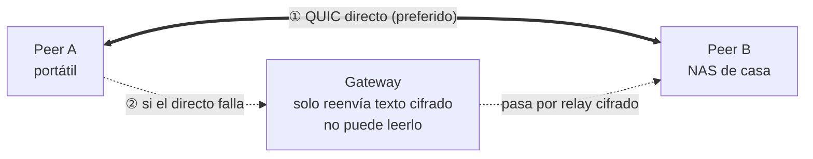

<h1 align="center">Lantunnel</h1>

<p align="center">
  <strong>Tu red privada, allá donde trabajes.</strong><br>
  Llega a las máquinas y servicios de tus propias redes locales desde cualquier sitio:
  primero punto a punto, cifrado de extremo a extremo, sin abrir puertos ni publicar nada.
</p>

<p align="center">
  <a href="https://github.com/lantunnel/lantunnel/actions/workflows/ci.yml"></a>
  <a href="https://lantunnel.app/"></a>
  <a href="./LICENSE"></a>
  
  
</p>

<p align="center">
  <a href="https://qm.qq.com/q/A5LX4uUwzC"></a>
  <a href="https://discord.gg/HsQK9cj2kh"></a>
</p>

<p align="center">
  <a href="https://buymeacoffee.com/buhuipao"></a>
</p>

<p align="center">
  <a href="https://lantunnel.app/">Web</a> ·
  <a href="https://lantunnel.app/download">Descargas</a> ·
  <a href="./docs/USAGE.es.md">Guía de uso</a> ·
  <a href="./CONTEXT.md">Arquitectura</a> ·
  <a href="./docs/PROTOCOL.md">Protocolo</a>
</p>

<p align="center">
  <a href="./README.md">English</a> ·
  <a href="./README.zh-CN.md">简体中文</a> ·
  <a href="./README.zh-TW.md">繁體中文</a> ·
  <a href="./README.ja.md">日本語</a> ·
  <b>Español</b> ·
  <a href="./README.de.md">Deutsch</a> ·
  <a href="./README.fr.md">Français</a>
</p>

---

El NAS está en casa. La máquina con GPU, en la oficina. Tu instancia de `ollama`, en el equipo que dejaste encendido antes de salir. Todas detrás de un NAT, y ninguna debería estar expuesta a internet.

Lantunnel reúne esas máquinas en una pequeña malla privada —un **Tunnel**— a la que solo entra quien haya recibido un perfil de tu mano. Los Peers se encuentran y hablan **directamente** siempre que la red lo permita. Cuando no lo permite, recurren a un **relay cifrado** a través de un Gateway que transporta texto cifrado que él mismo no puede leer. En ambos casos no se publica nada, no se abre ningún puerto del router y nada se descifra por el camino.

> ### 🚀 ¿No quieres montar un Gateway? No hace falta.
>
> **[lantunnel.app](https://lantunnel.app/)** incluye en cada cuenta un **Tunnel gratuito permanente**: tráfico punto a punto ilimitado, dispositivos LAN ilimitados detrás de cada Client y 5 GB al mes de relay cifrado para cuando la conexión directa no salga. Creas un Tunnel, descargas el Client, importas el perfil y listo. Sin servidor, sin certificados, sin DNS.
>
> Y si prefieres alojar el Gateway tú mismo, todo está en este repositorio, es Apache-2.0 y no se mide nada.
>
> **[→ Crea tu Tunnel gratuito](https://lantunnel.app/)**

---

<!-- lantunnel:toc -->
<a id="contents"></a>
## Contenido

**¿Es tu primera vez?** Ve directo a [Primeros pasos](#quick-start). Ahí están las cuatro formas de usar Lantunnel, de la más sencilla a la más laboriosa, y la primera son tres pasos sin ningún servidor que montar.

- [El Cliente](#the-client) — qué aspecto tiene la aplicación
- [Primeros pasos](#quick-start) — **empieza aquí**
  - [1. Usar el Gateway de la Plataforma](#mode-1) — *lo más sencillo, nada que desplegar*
  - [2. Tu Gateway, gestionado por la Plataforma](#mode-2)
  - [3. Montarlo todo tú](#mode-3)
  - [4. Entrar en el Tunnel de otra persona](#mode-4)
- [Qué obtienes](#what-you-get) · [Para qué lo usa la gente](#use-cases)
- [Cómo funciona](#how-it-works) — las tres piezas y por qué primero se intenta la conexión directa
- [Qué hay en este repositorio](#whats-inside)
- [Compilar desde el código](#building) · [Compatibilidad](#compatibility)
- [Proyectos relacionados](#related) · [Contribuir](#contributing) · [Licencia](#license)

**Para profundizar:** [Guía de uso completa](./docs/USAGE.es.md) · [Arquitectura y vocabulario](./CONTEXT.md) · [Protocolo de red](./docs/PROTOCOL.md)

---

<a id="the-client"></a>
## El Cliente

<table>
  <tr>
    <td width="25%" align="center" valign="top"><br><sub><b>Conexión</b><br>Estado, la IP Overlay de este Peer y los bytes directos frente a los retransmitidos.</sub></td>
    <td width="25%" align="center" valign="top"><br><sub><b>Peers</b><br>Cada Peer del Tunnel, su IP Overlay y la ruta en uso.</sub></td>
    <td width="25%" align="center" valign="top"><br><sub><b>Ajustes</b><br>Inicio al iniciar sesión, enrutamiento nativo y exportación de LAN.</sub></td>
    <td width="25%" align="center" valign="top"><br><sub><b>Acceso</b><br>El SOCKS5 en loopback y lo que este dispositivo acepta servir.</sub></td>
  </tr>
</table>

<a id="what-you-get"></a>
## Qué obtienes

| | |
|---|---|
| **Directo primero** | Cada flujo nuevo intenta primero una conexión QUIC punto a punto con perforación de NAT sobre UDP. El relay es el plan B, no el camino por defecto. |
| **Cifrado de extremo a extremo** | Lo que va por el relay se sella con XChaCha20-Poly1305 usando claves derivadas de un intercambio X25519 entre los dos Peers. El Gateway reenvía bytes que no puede descifrar. |
| **Sin abrir puertos** | Los Peers salen hacia fuera. Nada de tu LAN necesita una regla de entrada, una IP pública ni un nombre de dominio. |
| **Toda la LAN al alcance** | Un Peer puede publicar las subredes privadas en las que está, de modo que un solo Client en esa red hace accesibles el NAS, la impresora o el panel interno para el resto del Tunnel. |
| **El control es tuyo** | Cada Client decide qué sirve. La política de acceso vive en la máquina de destino: nunca en el Gateway, nunca en un servidor. |
| **Un binario, con o sin interfaz** | `lantunnel-client` abre una ventana de escritorio por defecto y ejecuta exactamente el mismo runtime con `--headless` en un servidor. |
| **En todas partes** | macOS, Windows, Linux, Android e iOS. |

<a id="use-cases"></a>
### Para qué lo usa la gente

- **Juegos y multimedia en streaming**: Sunshine/Moonlight, Jellyfin o Plex desde la máquina de casa.
- **IA privada y herramientas de desarrollo**: Ollama, Open WebUI, una API interna, un entorno de pruebas, una base de datos que jamás debe salir de la LAN.
- **Servicios domésticos y de oficina**: NAS, Home Assistant, cámaras, paneles internos, SSH.

<a id="how-it-works"></a>
## Cómo funciona



Tres piezas, y con eso está todo el sistema:

- **`lantunnel-client`** corre en cada dispositivo que se une. Importa un perfil `.peer` firmado, se conecta al Gateway y expone un proxy SOCKS5 en loopback, además de rutas nativas opcionales para que cualquier aplicación llegue al Tunnel sin saber que existe.
- **`lantunnel-gateway`** es un punto de encuentro y un señalizador para atravesar NAT. Admite un Tunnel porque guarda su archivo público `.scope`, ayuda a los Peers a abrir un camino directo y reenvía bytes sellados cuando no pueden. Nunca guarda claves privadas de Peer ni ve texto en claro.
- **`lantunnel-admin`** crea el Tunnel sin conexión. Dos comandos: `init-tunnel` genera el archivo de propietario y el scope público del Gateway, y `add-peer` emite un perfil firmado por dispositivo. No habla con nada.

La identidad se firma, no se comparte. No hay contraseña de Tunnel, ni secreto de grupo, ni token de portador: cada Peer tiene su propia clave Ed25519, demuestra que la posee en cada conexión, y esa clave nunca sale de la máquina que la generó.

📖 **[Arquitectura y conceptos →](./CONTEXT.md)**  ·  📐 **[Protocolo de red →](./docs/PROTOCOL.md)**

<!-- lantunnel:modes -->
<a id="quick-start"></a>
## Primeros pasos

Cuatro formas de usar Lantunnel, ordenadas por lo que tienes que montar. **La mayoría quiere la primera**: sin servidor, sin certificados y sin DNS.

| | Qué ejecutas | Qué necesitas | Qué cuesta |
|---|---|---|---|
| **1. [El Gateway de la Plataforma](#mode-1)** | Solo el Cliente | Una cuenta | Tunnel gratuito, tráfico directo ilimitado, 5 GB/mes de relay |
| **2. [Tu Gateway, gestionado por la Plataforma](#mode-2)** | El Cliente y un host de Gateway | Una cuenta y una máquina con dirección pública | Plan de pago; tu relay no se mide |
| **3. [Todo por tu cuenta](#mode-3)** | Las tres piezas | Una máquina con dirección pública | Gratis, Apache-2.0, sin cuenta, nunca contacta con la Plataforma |
| **4. [El Tunnel de otra persona](#mode-4)** | Solo el Cliente | Un archivo `.peer` que te envían | Lo que tenga montado esa persona |

<a id="mode-1"></a>
### 1. Usar el Gateway de la Plataforma — *lo más sencillo*

No hay nada que desplegar. La Plataforma opera la flota de Gateways; tú solo ejecutas el Cliente.

1. **Instala el Cliente** — [lantunnel.app/download](https://lantunnel.app/download).
2. **Inicia sesión** — pulsa «Sign in» en la pantalla de conexión. El Cliente abre tu navegador, apruebas el código que muestra y ya está. No hay ningún archivo que descargar.
3. **Añade un Peer** — pulsa «Add a Peer», elige tu Tunnel y ponle nombre a este dispositivo. El Cliente crea el Peer y lo importa de una sola vez.
4. **Conecta.**

Repítelo en cada dispositivo que quieras dentro del Tunnel. Después apunta una aplicación a `127.0.0.1:1080`, o activa el enrutado nativo y usa directamente las direcciones de la LAN.

<details>
<summary>¿Prefieres hacerlo en el navegador, o entrar desde el móvil?</summary>

Crea el Peer en [lantunnel.app](https://lantunnel.app/), descarga su archivo `.peer` y usa «Import .peer» en el Cliente. En Android e iOS el mismo perfil se importa escaneando su código QR.
</details>

<a id="mode-2"></a>
### 2. Tu Gateway, gestionado por la Plataforma

El tráfico pasa por tu máquina, así que el relay no se te contabiliza, y la Plataforma sigue encargándose de las cuentas, de las claves del Tunnel y de la emisión de Peers. Registras el Gateway una vez con un archivo de emparejamiento de un solo uso y se mantiene conectado hacia fuera: ningún puerto de entrada del lado de la Plataforma y ningún certificado que renovar a mano.

**[→ Guía de instalación de un Gateway conectado a la Plataforma](https://lantunnel.app/docs/installation#platform-connected)**  ·  [la misma secuencia, en este repositorio](./docs/USAGE.es.md#managed-onboarding)

<a id="mode-3"></a>
### 3. Montarlo todo tú

Sin cuenta, sin Plataforma, sin nada que salga al exterior. Creas el Tunnel sin conexión con `lantunnel-admin`, emites un `.peer` por dispositivo y ejecutas `lantunnel-gateway` en un host con dirección pública. Todo lo necesario está en este repositorio bajo Apache-2.0.

**[→ Recorrido completo autoalojado](./docs/USAGE.es.md#self-hosted)**

<a id="mode-4"></a>
### 4. Entrar en el Tunnel de otra persona

No hay nada que montar. Quien sea dueño del Tunnel emite un perfil `.peer` y te lo envía por un canal privado; tú instalas el Cliente y lo importas. Da igual si su Gateway es suyo o el de la Plataforma.

1. Instala el Cliente desde [lantunnel.app/download](https://lantunnel.app/download).
2. **Import .peer** — o escanea su código QR en el móvil.
3. **Conecta.**

> Un perfil por dispositivo. Un `.peer` lleva la clave privada de ese dispositivo y no está pensado para andar copiándose: pide uno tuyo en vez de compartir el de otra persona.

📘 **[Guía de uso completa — instalación, exposición de LAN, reglas de acceso, servidores, móvil, resolución de problemas →](./docs/USAGE.es.md)**

<a id="whats-inside"></a>
## Qué hay en este repositorio

Todo lo necesario para ejecutar Lantunnel por tu cuenta, bajo Apache-2.0:

| Ruta | Qué es |
|---|---|
| `apps/lantunnel-client` | El Client. Interfaz Tauri y runtime headless en un mismo binario. |
| `apps/lantunnel-gateway` | El Gateway. |
| `apps/lantunnel-admin` | Aprovisionamiento sin conexión: `init-tunnel`, `add-peer`. |
| `apps/android-proxy` | Aplicación Android (VpnService). |
| `apps/ios-proxy` | Aplicación iOS (NetworkExtension). |
| `crates/tp-*` | Implementación compartida: protocolo, transportes, proxies, P2P y los motores de Gateway y Client. |
| `docs/PROTOCOL.md` | Formato de red normativo. |
| `CONTEXT.md` | Arquitectura y vocabulario. |
| `docs/USAGE.es.md` | Cómo usarlo de verdad. |

La plataforma alojada en lantunnel.app —cuentas, facturación, flota de Gateways gestionados— es un servicio independiente de código cerrado y **no** forma parte de este repositorio. Nada de lo que hay aquí depende de ella, y una instalación autoalojada nunca la contacta.

<a id="building"></a>
## Compilar desde el código

Necesitas Rust 1.89 o superior, `protoc` para el transporte gRPC y Node para el frontend del Client.

```bash
# Gateway y herramienta de aprovisionamiento
cargo build --release -p lantunnel-gateway
cargo build --release -p lantunnel-admin

# Client (compila antes el frontend)
npm --prefix apps/lantunnel-client/frontend ci
npm --prefix apps/lantunnel-client/frontend run build
cargo build --release -p lantunnel-client
```

En Linux el Client enlaza con webkit2gtk, appindicator y rsvg; los paquetes `-dev` exactos están en [`.github/workflows/ci.yml`](./.github/workflows/ci.yml).

Comprobaciones, y una aceptación de extremo a extremo con tres Peers que verifica cada par dirigido de TCP y UDP primero por conexión directa y después por relay cifrado:

```bash
cargo fmt --all -- --check
cargo clippy --workspace --all-targets -- -D warnings
cargo test --workspace
tests/e2e/v2_docker/run.sh
```

<a id="compatibility"></a>
## Compatibilidad

Peers, Gateways y perfiles deben ser de la misma línea 2.0.x: el formato de red no se negocia entre versiones. ¿Vienes de una instalación 1.x? Sus perfiles no se pueden importar; crea otros nuevos con `lantunnel-admin`.

<a id="related"></a>
## Proyectos relacionados

Llegar a tus propias máquinas detrás de un NAT es un terreno concurrido y cordial. Lantunnel toma la vía peer-to-peer y cifrada de extremo a extremo; los proyectos siguientes resuelven problemas vecinos de otras maneras, y varios encajan bien junto a él.

### Redes peer-to-peer y de malla

El mismo objetivo que Lantunnel: reunir tus máquinas en una sola red privada en lugar de publicarlas.

- [Tailscale](https://github.com/tailscale/tailscale) — malla basada en WireGuard; el cliente es de código abierto, el servidor de coordinación no.
- [headscale](https://github.com/juanfont/headscale) — implementación open source y autoalojada del servidor de control de Tailscale.
- [ZeroTier](https://github.com/zerotier/ZeroTierOne) — red superpuesta de capa 2 con raíces globales, escrita en C++.
- [Nebula](https://github.com/slackhq/nebula) — red superpuesta peer-to-peer basada en certificados, creada en Slack; sin WireGuard y sin ruta de datos central.
- [NetBird](https://github.com/netbirdio/netbird) — red superpuesta sobre WireGuard con SSO, MFA y políticas de acceso granulares; alojada o autoalojada.
- [Netmaker](https://github.com/gravitl/netmaker) — malla sobre WireGuard del kernel, con servidor autoalojado e interfaz de administración.
- [EasyTier](https://github.com/EasyTier/EasyTier) — VPN de malla descentralizada en Rust, con NAT traversal, proxy de subredes y consola web.
- [innernet](https://github.com/tonarino/innernet) — red WireGuard pequeña en Rust que modela el acceso con CIDR en lugar de ACL improvisadas.
- [iroh](https://github.com/n0-computer/iroh) — biblioteca en Rust que añade QUIC y NAT traversal a tu propia aplicación, marcando a los pares por clave pública.
- [MeshLAN](https://github.com/zhaoxuya520/MeshLAN) — LAN virtual autoalojada y peer-to-peer primero, construida sobre Nebula, con compartición de servicios y varios relés.

### Túneles de relé y proxy inverso

La otra respuesta al NAT: un servidor público en medio que reenvía hacia tu LAN. Conviene cuando necesitas entregar una URL o un puerto a alguien que nunca va a instalar un cliente.

- [frp](https://github.com/fatedier/frp) — el proxy inverso de referencia para exponer un servicio detrás de NAT, y el motor que impulsa a la mayoría de las herramientas de abajo.
- [MoonProxy](https://github.com/MoonProxyHQ/moonproxy-desktop) — cliente GUI de escritorio para frp, gratuito y open source (MIT), construido con Tauri v2 + Rust + Vue 3, con reglas de proxy visuales, monitorización de tráfico en tiempo real y arranque/parada de frpc con un clic en Windows y macOS.
- [rathole](https://github.com/rathole-org/rathole) — proxy inverso ligero y de alto rendimiento en Rust para NAT traversal.
- [frp-panel](https://github.com/VaalaCat/frp-panel) — panel web multinodo para gestionar servidores y clientes de frp.
- [chisel](https://github.com/jpillora/chisel) — túnel TCP/UDP rápido transportado sobre HTTP, en un único binario de Go.
- [bore](https://github.com/ekzhang/bore) — CLI mínima en Rust para exponer un puerto local a través de un relé público.
- [zrok](https://github.com/openziti/zrok) — compartición construida sobre OpenZiti; pública o privada, efímera o reservada.
- [sish](https://github.com/antoniomika/sish) — túneles HTTP/WS/TCP hacia localhost usando solo SSH, sin nada que instalar en el cliente.
- [p2ptunnel](https://github.com/chenjia404/p2ptunnel) — túnel P2P de TCP/UDP para atravesar la red interna conectando directamente, sin servidor de relé.
- [umbra](https://github.com/chenow9/umbra) — pasarela TCP/UDP autoalojada para servicios tras NAT, con autorización por IP de origen y túneles de visitante basados en tickets.

### Listas y comparativas

- [awesome-tunneling](https://github.com/anderspitman/awesome-tunneling) — el catálogo de referencia de opciones de tunelización y redes superpuestas, autoalojadas y comerciales.

¿Mantienes algo que debería estar aquí? Abre un issue: lo añadimos encantados.

<a id="contributing"></a>
## Contribuir

Los issues y pull requests son bienvenidos; consulta [CONTRIBUTING.md](./CONTRIBUTING.md) para compilación, pruebas y estilo. ¿Has encontrado una vulnerabilidad? Repórtala en privado siguiendo [SECURITY.md](./SECURITY.md), no en un issue público.

<a id="license"></a>
## Licencia

Apache License 2.0 — consulta [LICENSE](./LICENSE) y [NOTICE](./NOTICE).

---

> Esta es la versión en español del [README.md](./README.md) original. Si ambas difieren, la versión en inglés prevalece.

<p align="center">
  <strong>Sáltate el montaje.</strong> Un Tunnel gratuito permanente, tráfico directo ilimitado y Gateways gestionados a la espera.<br>
  <a href="https://lantunnel.app/"><strong>Empieza en lantunnel.app →</strong></a>
</p>
