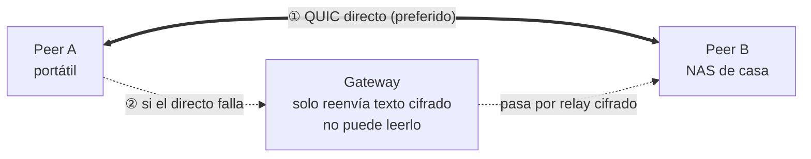

<h1 align="center">Lantunnel</h1>

<p align="center">
  <strong>Tu red privada, allá donde trabajes.</strong><br>
  Llega a las máquinas y servicios de tus propias redes locales desde cualquier sitio:
  primero punto a punto, cifrado de extremo a extremo, sin abrir puertos ni publicar nada.
</p>

<p align="center">
  <a href="https://github.com/lantunnel/lantunnel/actions/workflows/ci.yml"></a>
  <a href="https://lantunnel.app/"></a>
  <a href="./LICENSE"></a>
  
  
</p>

<p align="center">
  <a href="https://qm.qq.com/q/A5LX4uUwzC"></a>
  <a href="https://discord.gg/HsQK9cj2kh"></a>
</p>

<p align="center">
  <a href="https://lantunnel.app/">Web</a> ·
  <a href="https://lantunnel.app/download">Descargas</a> ·
  <a href="./docs/USAGE.es.md">Guía de uso</a> ·
  <a href="./CONTEXT.md">Arquitectura</a> ·
  <a href="./docs/PROTOCOL.md">Protocolo</a>
</p>

<p align="center">
  <a href="./README.md">English</a> ·
  <a href="./README.zh-CN.md">简体中文</a> ·
  <a href="./README.zh-TW.md">繁體中文</a> ·
  <a href="./README.ja.md">日本語</a> ·
  <b>Español</b> ·
  <a href="./README.de.md">Deutsch</a> ·
  <a href="./README.fr.md">Français</a>
</p>

---

El NAS está en casa. La máquina con GPU, en la oficina. Tu instancia de `ollama`, en el equipo que dejaste encendido antes de salir. Todas detrás de un NAT, y ninguna debería estar expuesta a internet.

Lantunnel reúne esas máquinas en una pequeña malla privada —un **Tunnel**— a la que solo entra quien haya recibido un perfil de tu mano. Los Peers se encuentran y hablan **directamente** siempre que la red lo permita. Cuando no lo permite, recurren a un **relay cifrado** a través de un Gateway que transporta texto cifrado que él mismo no puede leer. En ambos casos no se publica nada, no se abre ningún puerto del router y nada se descifra por el camino.

> ### 🚀 ¿No quieres montar un Gateway? No hace falta.
>
> **[lantunnel.app](https://lantunnel.app/)** incluye en cada cuenta un **Tunnel gratuito permanente**: tráfico punto a punto ilimitado, dispositivos LAN ilimitados detrás de cada Client y 5 GB al mes de relay cifrado para cuando la conexión directa no salga. Creas un Tunnel, descargas el Client, importas el perfil y listo. Sin servidor, sin certificados, sin DNS.
>
> Y si prefieres alojar el Gateway tú mismo, todo está en este repositorio, es Apache-2.0 y no se mide nada.
>
> **[→ Crea tu Tunnel gratuito](https://lantunnel.app/)**

---

## Qué obtienes

| | |
|---|---|
| **Directo primero** | Cada flujo nuevo intenta primero una conexión QUIC punto a punto con perforación de NAT sobre UDP. El relay es el plan B, no el camino por defecto. |
| **Cifrado de extremo a extremo** | Lo que va por el relay se sella con XChaCha20-Poly1305 usando claves derivadas de un intercambio X25519 entre los dos Peers. El Gateway reenvía bytes que no puede descifrar. |
| **Sin abrir puertos** | Los Peers salen hacia fuera. Nada de tu LAN necesita una regla de entrada, una IP pública ni un nombre de dominio. |
| **Toda la LAN al alcance** | Un Peer puede publicar las subredes privadas en las que está, de modo que un solo Client en esa red hace accesibles el NAS, la impresora o el panel interno para el resto del Tunnel. |
| **El control es tuyo** | Cada Client decide qué sirve. La política de acceso vive en la máquina de destino: nunca en el Gateway, nunca en un servidor. |
| **Un binario, con o sin interfaz** | `lantunnel-client` abre una ventana de escritorio por defecto y ejecuta exactamente el mismo runtime con `--headless` en un servidor. |
| **En todas partes** | macOS, Windows, Linux, Android e iOS. |

### Para qué lo usa la gente

- **Juegos y multimedia en streaming**: Sunshine/Moonlight, Jellyfin o Plex desde la máquina de casa.
- **IA privada y herramientas de desarrollo**: Ollama, Open WebUI, una API interna, un entorno de pruebas, una base de datos que jamás debe salir de la LAN.
- **Servicios domésticos y de oficina**: NAS, Home Assistant, cámaras, paneles internos, SSH.

## Cómo funciona



Tres piezas, y con eso está todo el sistema:

- **`lantunnel-client`** corre en cada dispositivo que se une. Importa un perfil `.peer` firmado, se conecta al Gateway y expone un proxy SOCKS5 en loopback, además de rutas nativas opcionales para que cualquier aplicación llegue al Tunnel sin saber que existe.
- **`lantunnel-gateway`** es un punto de encuentro y un señalizador para atravesar NAT. Admite un Tunnel porque guarda su archivo público `.scope`, ayuda a los Peers a abrir un camino directo y reenvía bytes sellados cuando no pueden. Nunca guarda claves privadas de Peer ni ve texto en claro.
- **`lantunnel-admin`** crea el Tunnel sin conexión. Dos comandos: `init-tunnel` genera el archivo de propietario y el scope público del Gateway, y `add-peer` emite un perfil firmado por dispositivo. No habla con nada.

La identidad se firma, no se comparte. No hay contraseña de Tunnel, ni secreto de grupo, ni token de portador: cada Peer tiene su propia clave Ed25519, demuestra que la posee en cada conexión, y esa clave nunca sale de la máquina que la generó.

📖 **[Arquitectura y conceptos →](./CONTEXT.md)**  ·  📐 **[Protocolo de red →](./docs/PROTOCOL.md)**

## Primeros pasos

### La vía rápida: Gateway alojado

1. Crea tu Tunnel gratuito en **[lantunnel.app](https://lantunnel.app/)**.
2. Añade un Peer por dispositivo y descarga su perfil `.peer`.
3. Instala el Client desde **[lantunnel.app/download](https://lantunnel.app/download)** e importa el perfil.

Ya está. Apunta una aplicación a `127.0.0.1:1080`, o activa el enrutado nativo y usa directamente las direcciones LAN.

### La vía propia: tu Gateway, tus reglas

```bash
# 1. En el host del Gateway, inicializa un Gateway independiente sin conexión.
lantunnel-gateway init --public-ip <PUBLIC_IP>
#   Predeterminados: QUIC/8443 y mapeo UDP/8444. Para usar otro puerto, añade aquí
#   --mapping-port <PORT> y pasa el mismo valor a --gateway-mapping-port más abajo.
#   crea configs/gateway.yaml, certs/server.crt, certs/server.key y state/scopes.d

# 2. Copia solo server.crt como ./server.crt al equipo de confianza del propietario y crea allí
#    el Tunnel sin conexión.
lantunnel-admin init-tunnel \
  --gateway-transport quic \
  --gateway-ip <PUBLIC_IP> \
  --gateway-port 8443 \
  --gateway-mapping-port 8444 \
  --gateway-cert ./server.crt
#   → <tunnel-id>.tunnel   guárdalo bien: es la clave de firma del Tunnel
#   → <tunnel-id>.scope    público; es todo lo que el Gateway necesita

# 3. Emite un perfil por dispositivo.
lantunnel-admin add-peer --tunnel <tunnel-id>.tunnel --name laptop --output laptop.peer
lantunnel-admin add-peer --tunnel <tunnel-id>.tunnel --name nas    --output nas.peer

# 4. Instala el scope público en el host del Gateway y arráncalo.
cp <tunnel-id>.scope state/scopes.d/
lantunnel-gateway --config configs/gateway.yaml

# 5. En cada dispositivo, importa su propio perfil y conecta.
lantunnel-client tunnel import ./laptop.peer
lantunnel-client                          # interfaz de escritorio
lantunnel-client connect '<tunnel_id>'    # mismo runtime, sin ventana
```

`init` se ejecuta totalmente sin conexión y no contacta con lantunnel.app ni con ninguna plataforma. `certs/server.key` permanece en el host del Gateway. Repetir exactamente el mismo comando conserva sin cambios la clave, el certificado y la configuración. Con el mismo archivo `--config`, la repetición exacta de `init`, la validación y el arranque funcionan desde cualquier directorio de trabajo. La configuración con un nombre de host o un certificado de una CA pública sigue el procedimiento manual avanzado de la guía completa.

Un perfil por dispositivo: un `.peer` no está pensado para copiarse de un sitio a otro.

📘 **[Guía completa: instalación, publicación de LAN, reglas de acceso, servidores, móvil y resolución de problemas →](./docs/USAGE.es.md)**

## Qué hay en este repositorio

Todo lo necesario para ejecutar Lantunnel por tu cuenta, bajo Apache-2.0:

| Ruta | Qué es |
|---|---|
| `apps/lantunnel-client` | El Client. Interfaz Tauri y runtime headless en un mismo binario. |
| `apps/lantunnel-gateway` | El Gateway. |
| `apps/lantunnel-admin` | Aprovisionamiento sin conexión: `init-tunnel`, `add-peer`. |
| `apps/android-proxy` | Aplicación Android (VpnService). |
| `apps/ios-proxy` | Aplicación iOS (NetworkExtension). |
| `crates/tp-*` | Implementación compartida: protocolo, transportes, proxies, P2P y los motores de Gateway y Client. |
| `docs/PROTOCOL.md` | Formato de red normativo. |
| `CONTEXT.md` | Arquitectura y vocabulario. |
| `docs/USAGE.es.md` | Cómo usarlo de verdad. |

La plataforma alojada en lantunnel.app —cuentas, facturación, flota de Gateways gestionados— es un servicio independiente de código cerrado y **no** forma parte de este repositorio. Nada de lo que hay aquí depende de ella, y una instalación autoalojada nunca la contacta.

## Compilar desde el código

Necesitas Rust 1.89 o superior, `protoc` para el transporte gRPC y Node para el frontend del Client.

```bash
# Gateway y herramienta de aprovisionamiento
cargo build --release -p lantunnel-gateway
cargo build --release -p lantunnel-admin

# Client (compila antes el frontend)
npm --prefix apps/lantunnel-client/frontend ci
npm --prefix apps/lantunnel-client/frontend run build
cargo build --release -p lantunnel-client
```

En Linux el Client enlaza con webkit2gtk, appindicator y rsvg; los paquetes `-dev` exactos están en [`.github/workflows/ci.yml`](./.github/workflows/ci.yml).

Comprobaciones, y una aceptación de extremo a extremo con tres Peers que verifica cada par dirigido de TCP y UDP primero por conexión directa y después por relay cifrado:

```bash
cargo fmt --all -- --check
cargo clippy --workspace --all-targets -- -D warnings
cargo test --workspace
tests/e2e/v2_docker/run.sh
```

## Compatibilidad

Peers, Gateways y perfiles deben ser de la misma línea 2.0.x: el formato de red no se negocia entre versiones. ¿Vienes de una instalación 1.x? Sus perfiles no se pueden importar; crea otros nuevos con `lantunnel-admin`.

## Contribuir

Los issues y pull requests son bienvenidos; consulta [CONTRIBUTING.md](./CONTRIBUTING.md) para compilación, pruebas y estilo. ¿Has encontrado una vulnerabilidad? Repórtala en privado siguiendo [SECURITY.md](./SECURITY.md), no en un issue público.

## Licencia

Apache License 2.0 — consulta [LICENSE](./LICENSE) y [NOTICE](./NOTICE).

---

> Esta es la versión en español del [README.md](./README.md) original. Si ambas difieren, la versión en inglés prevalece.

<p align="center">
  <strong>Sáltate el montaje.</strong> Un Tunnel gratuito permanente, tráfico directo ilimitado y Gateways gestionados a la espera.<br>
  <a href="https://lantunnel.app/"><strong>Empieza en lantunnel.app →</strong></a>
</p>
