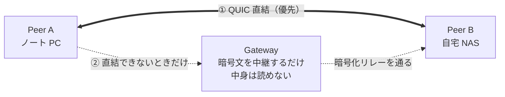

<h1 align="center">Lantunnel</h1>

<p align="center">
  <strong>自分のプライベートネットワークを、どこへでも。</strong><br>
  自宅や社内 LAN のマシンとサービスに、どこからでも到達する。P2P 直結を最優先、
  エンドツーエンド暗号化、ポート開放も公開 URL も不要。
</p>

<p align="center">
  <a href="https://github.com/lantunnel/lantunnel/actions/workflows/ci.yml"></a>
  <a href="https://lantunnel.app/"></a>
  <a href="./LICENSE"></a>
  
  
</p>

<p align="center">
  <a href="https://qm.qq.com/q/A5LX4uUwzC"></a>
  <a href="https://discord.gg/HsQK9cj2kh"></a>
</p>

<p align="center">
  <a href="https://buymeacoffee.com/buhuipao"></a>
</p>

<p align="center">
  <a href="https://lantunnel.app/">公式サイト</a> ·
  <a href="https://lantunnel.app/download">ダウンロード</a> ·
  <a href="./docs/USAGE.ja.md">使い方ガイド</a> ·
  <a href="./CONTEXT.md">アーキテクチャ</a> ·
  <a href="./docs/PROTOCOL.md">プロトコル仕様</a>
</p>

<p align="center">
  <a href="./README.md">English</a> ·
  <a href="./README.zh-CN.md">简体中文</a> ·
  <a href="./README.zh-TW.md">繁體中文</a> ·
  <b>日本語</b> ·
  <a href="./README.es.md">Español</a> ·
  <a href="./README.de.md">Deutsch</a> ·
  <a href="./README.fr.md">Français</a>
</p>

---

NAS は自宅に。GPU マシンは職場に。`ollama` は出かけるときに置いてきたデスクトップの中。どれも NAT の内側にいて、どれ一つとしてインターネットに晒すべきではありません。

Lantunnel は、そうしたマシンを一つの小さなプライベートメッシュ — **Tunnel** — にまとめます。参加できるのは、あなたがプロファイルを渡した相手だけです。ネットワークが許せば Peer 同士は**直接**つながり、直接つながらないときは Gateway 経由の**暗号化リレー**にフォールバックします。この Gateway が中継するのは、Gateway 自身にも復号できない暗号文です。どちらの経路でも、何かを公開することはなく、ルーターのポートを開けることもなく、途中で平文が読まれることもありません。

> ### 🚀 Gateway を自分で立てたくない？立てなくて構いません。
>
> **[lantunnel.app](https://lantunnel.app/)** では、アカウントごとに**恒久無料の Tunnel** を 1 本提供しています。P2P 通信は無制限、各 Client の背後に置く LAN 機器の台数も無制限。加えて、直接つながらなかったときのために暗号化リレーを月 5 GB。Tunnel を作り、Client をダウンロードし、プロファイルを取り込む。それだけです。サーバーも証明書も DNS 設定も要りません。
>
> Gateway を自分でホストしたい場合も、その一式はこのリポジトリにあります。Apache-2.0 で、計測も一切ありません。
>
> **[→ 無料 Tunnel を作る](https://lantunnel.app/)**

---

<!-- lantunnel:toc -->
<a id="contents"></a>
## 目次

**はじめてなら** [クイックスタート](#quick-start) へどうぞ。用意する手間が少ない順に 4 つのやり方を並べてあります。いちばん簡単なものは 3 ステップで、サーバーは要りません。

- [Client の画面](#the-client) — アプリの見た目
- [クイックスタート](#quick-start) — **ここから**
  - [1. Platform の Gateway を使う](#mode-1) — *いちばん簡単、構築ゼロ*
  - [2. Gateway は自前、運用は Platform に任せる](#mode-2)
  - [3. すべて自分で動かす](#mode-3)
  - [4. 自分の Tunnel を、友人の Gateway で動かす](#mode-4)
- [できること](#what-you-get) · [実際の使いどころ](#use-cases)
- [しくみ](#how-it-works) — 3 つの部品と、直結を先に試す理由
- [リポジトリの中身](#whats-inside)
- [ソースからビルド](#building) · [互換性](#compatibility)
- [関連プロジェクト](#related) · [コントリビュート](#contributing) · [ライセンス](#license)

**さらに詳しく：** [使い方ガイド](./docs/USAGE.ja.md) · [アーキテクチャと用語](./CONTEXT.md) · [ワイヤープロトコル](./docs/PROTOCOL.md)

---

<a id="the-client"></a>
## Client の画面

<table>
  <tr>
    <td width="25%" align="center" valign="top"><br><sub><b>接続</b><br>接続状態、この Peer の Overlay IP、直接とリレーそれぞれの通信量、そしてサインイン中のアカウント。</sub></td>
    <td width="25%" align="center" valign="top"><br><sub><b>Peers</b><br>Tunnel にいる各 Peer と、その Overlay IP、いま使っている経路。</sub></td>
    <td width="25%" align="center" valign="top"><br><sub><b>設定</b><br>ログイン時に起動、ネイティブルーティング、LAN 公開。</sub></td>
    <td width="25%" align="center" valign="top"><br><sub><b>アクセス</b><br>ループバックの SOCKS5 リスナーと、この端末が提供する範囲。</sub></td>
  </tr>
</table>

<a id="what-you-get"></a>
## できること

| | |
|---|---|
| **直結ファースト** | 新しいフローはまず P2P の QUIC 直結を試み、UDP ホールパンチングを行います。リレーはフォールバックであって既定経路ではありません。 |
| **エンドツーエンド暗号化** | リレーされるペイロードは、2 つの Peer 間の X25519 交換から導出した鍵で XChaCha20-Poly1305 により封をされます。Gateway が中継するのは復号できないバイト列です。 |
| **ポート開放不要** | Peer は外向きに接続します。LAN 側の機器に着信ルール、グローバル IP、ホスト名は一切要りません。 |
| **LAN 全体に届く** | Peer は自分が接続しているプライベートサブネットを公開できます。ネットワークに Client を 1 台置けば、NAS もプリンターもダッシュボードも Tunnel の他のメンバーから到達可能になります。 |
| **ACL はあなたの手元に** | 何を提供するかは各 Client が決めます。アクセスポリシーは到達される側のマシンに置かれます。Gateway でもサーバーでもありません。 |
| **1 つのバイナリ、GUI でも headless でも** | `lantunnel-client` は既定でデスクトップウィンドウを開き、`--headless` を付ければ同じランタイムがサーバー上で動きます。 |
| **主要プラットフォーム対応** | macOS、Windows、Linux、Android、iOS。 |

<a id="use-cases"></a>
### 実際の使いどころ

- **ゲーム・メディアストリーミング** — 自宅のマシンで動く Sunshine/Moonlight、Jellyfin、Plex。
- **プライベート AI と開発ツール** — Ollama、Open WebUI、社内 API、ステージング環境、LAN から出してはいけないデータベース。
- **家庭・オフィスのサービス** — NAS、Home Assistant、カメラ、社内ダッシュボード、SSH。

<a id="how-it-works"></a>
## しくみ



システムの構成要素はこの 3 つだけです。

- **`lantunnel-client`** は参加する各デバイスで動きます。署名済みの `.peer` プロファイルを 1 つ取り込んで Gateway に接続し、ループバックの SOCKS5 プロキシを公開します。ネイティブルートを有効にすれば、通常のアプリは Lantunnel の存在を知らないまま Tunnel に到達できます。
- **`lantunnel-gateway`** はランデブーポイントであり、NAT 越えのシグナリング役です。公開ファイル `.scope` を保持することで Tunnel の接続を許可し、Peer 同士の直結を助け、それが無理なときだけ封をされたバイト列を中継します。Peer の秘密鍵は持たず、平文も見えません。
- **`lantunnel-admin`** は Tunnel をオフラインで作ります。コマンドは 2 つ。`init-tunnel` がオーナーファイルと Gateway 用の公開 scope を生成し、`add-peer` がデバイスごとに署名済みプロファイルを発行します。ネットワークには一切アクセスしません。

同一性は署名で担保されます。共有秘密ではありません。Tunnel パスワードもグループシークレットもベアラートークンもなく、各 Peer が自分の Ed25519 鍵を持ち、接続のたびにその所持を証明します。そしてその鍵は、生成したマシンから決して出ません。

📖 **[アーキテクチャと概念 →](./CONTEXT.md)**  ·  📐 **[ワイヤプロトコル →](./docs/PROTOCOL.md)**

<!-- lantunnel:modes -->
<a id="quick-start"></a>
## クイックスタート

用意する手間が少ない順に 4 つ。**たいていの人は 1 番目で足ります** — サーバーも証明書も DNS も要りません。

| | 動かすもの | 必要なもの | 費用 |
|---|---|---|---|
| **1. [Platform の Gateway](#mode-1)** | Client だけ | アカウント | 無料 Tunnel、直結は無制限、リレー月 5 GB |
| **2. [自前の Gateway を Platform が運用](#mode-2)** | Client と Gateway ホスト | アカウントと、グローバルアドレスを持つマシン | 有料プラン。自分のリレーは計量されない |
| **3. [すべて自分で](#mode-3)** | 3 つの部品すべて | グローバルアドレスを持つマシン | 無料・Apache-2.0・アカウント不要・Platform に一切接続しない |
| **4. [自分の Tunnel を友人の Gateway に](#mode-4)** | Client と、一度だけオフラインで `lantunnel-admin` | すでに Gateway を動かしている友人 | 無料。リレーは相手のマシンが担う |

<a id="mode-1"></a>
### 1. Platform の Gateway を使う — *いちばん簡単*

構築するものはありません。Gateway 群は Platform が動かし、あなたは Client だけを動かします。

1. **Client を入れる** — [lantunnel.app/download](https://lantunnel.app/download)。
2. **サインイン** — 接続画面の「Sign in」を押します。Client がブラウザーを開くので、表示されたコードを見比べて承認すれば完了です。ファイルのダウンロードはありません。
3. **Peer を追加** — 「Add a Peer」を押し、Tunnel を選び、この端末に名前を付けます。Client が Peer の作成と取り込みを一度に済ませます。
4. **接続。**

Tunnel に入れたい端末ごとに繰り返します。あとはアプリのプロキシを `127.0.0.1:1080` に向けるか、ネイティブルーティングを有効にして LAN アドレスをそのまま使ってください。

<details>
<summary>ブラウザーで操作したい、あるいはスマホから参加したい場合</summary>

[lantunnel.app](https://lantunnel.app/) で Peer を作り、`.peer` ファイルをダウンロードして、Client の「Import .peer」から取り込みます。Android と iOS では同じプロファイルを QR コードで読み取れます。
</details>

<a id="mode-2"></a>
### 2. Gateway は自前、運用は Platform に任せる

トラフィックは自分のマシンを通るのでリレーは課金対象になりません。アカウント、Tunnel の署名鍵、Peer の発行は引き続き Platform が担当します。一度きりのペアリングファイルで Gateway を登録すれば、あとは外向きの接続を保ち続けます。Platform 側で受信ポートを開ける必要も、手で更新する証明書もありません。

**[→ Platform 接続型 Gateway のインストールガイド](https://lantunnel.app/docs/installation#platform-connected)**  ·  [同じ手順をこのリポジトリで](./docs/USAGE.ja.md#managed-onboarding)

<a id="mode-3"></a>
### 3. すべて自分で動かす

アカウントなし、Platform なし、外部への通信もなし。`lantunnel-admin` でオフラインのまま Tunnel を作り、端末ごとに `.peer` を発行し、グローバルアドレスを持つホストで `lantunnel-gateway` を動かします。必要なものはすべてこのリポジトリに Apache-2.0 で入っています。

**[→ セルフホストの全手順](./docs/USAGE.ja.md#self-hosted)**

<a id="mode-4"></a>
### 4. 自分の Tunnel を、友人の Gateway で動かす

サーバーを持たない 3 番目のやり方です。Tunnel はあくまで自分のもの —— オフラインで作り、`.peer` も自分で発行します —— すでに Gateway を動かしている友人は、それを通すだけ。トランスポート、アドレス、データポート、mapping ポート、そして証明書が自己署名なら公開用の `server.crt` を聞いてください：

```bash
lantunnel-admin init-tunnel --gateway-transport quic \
  --gateway-ip <相手の IP> --gateway-port 8443 --gateway-mapping-port 8444 \
  --gateway-cert ./server.crt --output-dir ./provision

lantunnel-admin add-peer --tunnel ./provision/<tunnel-id>.tunnel \
  --name laptop --output ./provision/laptop.peer
```

相手に渡すのは `<tunnel-id>.scope` だけ。相手はそれを自分の `scopes.d` に置いて reload します。Gateway 1 台は、持っている scope の数だけ Tunnel を通せます。

> `.scope` の中身は Tunnel ID と署名用の公開鍵だけ。相手の Gateway があなたの Peer を通すためのもので、それ以上は何も与えません。あなたの Tunnel に Peer を発行することも、あなたの Peer を持ち出すことも、通信を読むこともできません —— リレーされるバイト列は 2 つの Peer の間で封をされています。メンバーシップに署名する `.tunnel` は、あなたのマシンから出ません。

**[→ Gateway を共有するとき、双方が何をするか](./docs/USAGE.ja.md#shared-gateway)**

誰かが自分の Tunnel から発行した `.peer` を渡してくる場合、それは別のやり方ではありません。Client を入れて **Import .peer**（スマホなら QR コード）、そして接続するだけです。ただしプロファイルは 1 端末に 1 つ。`.peer` にはその端末の秘密鍵が入っているので、人のものを共有せず自分の分を発行してもらってください。

📘 **[使い方ガイド — インストール、LAN 公開、アクセス制御、サーバー、モバイル、トラブルシューティング →](./docs/USAGE.ja.md)**

<a id="whats-inside"></a>
## リポジトリの中身

Lantunnel を自分で動かすために必要なものはすべて Apache-2.0 で入っています。

| パス | 内容 |
|---|---|
| `apps/lantunnel-client` | Client。Tauri デスクトップ UI と headless ランタイムが 1 つのバイナリに。 |
| `apps/lantunnel-gateway` | Gateway。 |
| `apps/lantunnel-admin` | オフラインプロビジョニング：`init-tunnel`、`add-peer`。 |
| `apps/android-proxy` | Android アプリ（VpnService）。 |
| `apps/ios-proxy` | iOS アプリ（NetworkExtension）。 |
| `crates/tp-*` | 共通実装 — プロトコル、トランスポート、プロキシ、P2P、Gateway と Client のエンジン。 |
| `docs/PROTOCOL.md` | ワイヤフォーマットの規範文書。 |
| `CONTEXT.md` | アーキテクチャと用語。 |
| `docs/USAGE.ja.md` | 実際の使い方。 |

lantunnel.app のホスト型プラットフォーム（アカウント、課金、マネージド Gateway フリート）は独立したクローズドソースのサービスで、このリポジトリには**含まれません**。ここのコードはそれに依存せず、セルフホスト構成が接続することもありません。

<a id="building"></a>
## ソースからビルド

Rust 1.89 以上、gRPC トランスポート用の `protoc`、Client フロントエンド用の Node が必要です。

```bash
# Gateway とプロビジョニングツール
cargo build --release -p lantunnel-gateway
cargo build --release -p lantunnel-admin

# Client（先にフロントエンドをビルド）
npm --prefix apps/lantunnel-client/frontend ci
npm --prefix apps/lantunnel-client/frontend run build
cargo build --release -p lantunnel-client
```

Linux では Client が webkit2gtk、appindicator、rsvg にリンクします。必要な `-dev` パッケージの一覧は [`.github/workflows/ci.yml`](./.github/workflows/ci.yml) を参照してください。

各種チェックと、3 Peer によるエンドツーエンド受け入れテスト。後者は TCP と UDP の全方向の組み合わせを、まず直結で、続いて暗号化リレーで検証します。

```bash
cargo fmt --all -- --check
cargo clippy --workspace --all-targets -- -D warnings
cargo test --workspace
tests/e2e/v2_docker/run.sh
```

<a id="compatibility"></a>
## 互換性

Peer、Gateway、プロファイルは同じ 2.0.x 系列で揃える必要があります。ワイヤフォーマットはバージョン間でネゴシエートしません。1.x からの移行では旧プロファイルを取り込めないため、`lantunnel-admin` で新規に発行してください。

<a id="related"></a>
## 関連プロジェクト

NAT の内側にある自分のマシンへ到達する、というのは賑やかで友好的な分野です。Lantunnel は P2P 優先・エンドツーエンド暗号化という道を選んでいます。以下のプロジェクトは近い問題を別のやり方で解いており、いくつかは Lantunnel と併用しても相性が良いものです。

### P2P・メッシュネットワーク

Lantunnel と同じゴール — 自分のマシンを公開するのではなく、ひとつのプライベートネットワークにまとめる。

- [Tailscale](https://github.com/tailscale/tailscale) — WireGuard ベースのメッシュ。クライアントはオープンソース、コーディネーションサーバーはクローズド。
- [headscale](https://github.com/juanfont/headscale) — Tailscale コントロールサーバーのセルフホスト可能なオープンソース実装。
- [ZeroTier](https://github.com/zerotier/ZeroTierOne) — グローバルなルートノードを持つ L2 オーバーレイネットワーク。C++ 実装。
- [Nebula](https://github.com/slackhq/nebula) — Slack 発の証明書ベース P2P オーバーレイ。WireGuard を使わず、データ経路も中央を通りません。
- [NetBird](https://github.com/netbirdio/netbird) — SSO・MFA・きめ細かいアクセスポリシーを備えた WireGuard オーバーレイ。ホスト型もセルフホストも可能。
- [Netmaker](https://github.com/gravitl/netmaker) — カーネル WireGuard で動くメッシュ。セルフホストのサーバーと管理 UI 付き。
- [EasyTier](https://github.com/EasyTier/EasyTier) — Rust 製の分散型メッシュ VPN。NAT トラバーサル、サブネットプロキシ、Web コンソールに対応。
- [innernet](https://github.com/tonarino/innernet) — 小さな Rust 製 WireGuard ネットワーク。アクセス制御を場当たり的な ACL ではなく CIDR で表現します。
- [iroh](https://github.com/n0-computer/iroh) — 自作アプリに QUIC と NAT トラバーサルを足す Rust ライブラリ。公開鍵でピアに直接ダイヤルします。
- [MeshLAN](https://github.com/zhaoxuya520/MeshLAN) — Nebula 上に構築されたセルフホスト型 P2P 優先の仮想 LAN。サービス共有と複数リレーに対応。

### リレー・リバースプロキシ型トンネル

NAT に対するもうひとつの答え — 公開サーバーを中継に置き、そこから LAN へ転送する方式です。クライアントを絶対にインストールしない相手に URL やポートを渡したいときは、こちらが向いています。

- [frp](https://github.com/fatedier/frp) — NAT 内のサービスを公開するリバースプロキシの定番であり、以下の多くのツールが動かしているエンジン。
- [MoonProxy](https://github.com/MoonProxyHQ/moonproxy-desktop) — Tauri v2 + Rust + Vue 3 製の無料・オープンソース（MIT）な frp デスクトップ GUI クライアント。プロキシルールの可視化、リアルタイムのトラフィック監視、Windows / macOS でのワンクリック frpc 起動・停止。
- [rathole](https://github.com/rathole-org/rathole) — 軽量・高性能な Rust 製 NAT トラバーサル用リバースプロキシ。
- [frp-panel](https://github.com/VaalaCat/frp-panel) — frp のサーバーとクライアントを管理するマルチノード Web コントロールパネル。
- [chisel](https://github.com/jpillora/chisel) — HTTP 上を通る高速な TCP/UDP トンネル。Go の単一バイナリ。
- [bore](https://github.com/ekzhang/bore) — ローカルポートをひとつ、公開リレー経由で露出する最小構成の Rust CLI。
- [zrok](https://github.com/openziti/zrok) — OpenZiti 上に構築された共有ツール。公開／非公開、一時的／予約済みを選べます。
- [sish](https://github.com/antoniomika/sish) — SSH だけでローカルへ張る HTTP/WS/TCP トンネル。クライアント側に入れるものはありません。
- [p2ptunnel](https://github.com/chenjia404/p2ptunnel) — P2P の TCP/UDP イントラネット貫通トンネル。リレーサーバーなしで直接つながります。
- [umbra](https://github.com/chenow9/umbra) — NAT 内サービス向けのセルフホスト型 TCP/UDP ゲートウェイ。送信元 IP 認可とチケット方式のゲストトンネルに対応。

### 一覧と比較

- [awesome-tunneling](https://github.com/anderspitman/awesome-tunneling) — トンネリングとオーバーレイネットワークの定番カタログ。セルフホストも商用も網羅。

ここに載るべきプロジェクトを開発していますか？ Issue を立ててください。喜んで追加します。

<a id="contributing"></a>
## コントリビュート

Issue と Pull Request を歓迎します。ビルド、テスト、コードスタイルについては [CONTRIBUTING.md](./CONTRIBUTING.md) を参照してください。脆弱性を見つけた場合は公開 Issue ではなく、[SECURITY.md](./SECURITY.md) の手順で非公開に報告してください。

<a id="license"></a>
## ライセンス

Apache License 2.0 — [LICENSE](./LICENSE) と [NOTICE](./NOTICE) を参照。

---

> 本書は英語版 [README.md](./README.md) の日本語訳です。内容に食い違いがある場合は英語版が優先します。

<p align="center">
  <strong>セットアップは省きたい。</strong> 恒久無料の Tunnel が 1 本、P2P 通信は無制限、マネージド Gateway が待機中。<br>
  <a href="https://lantunnel.app/"><strong>lantunnel.app ではじめる →</strong></a>
</p>
