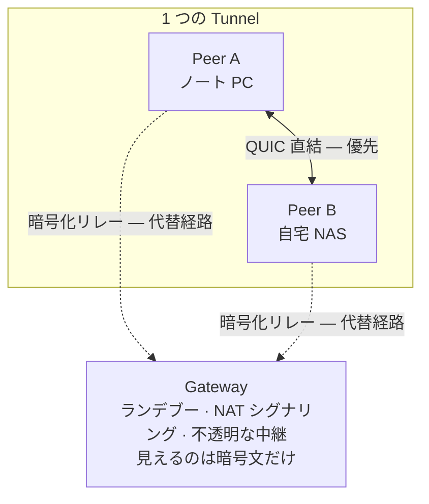

<h1 align="center">Lantunnel</h1>

<p align="center">
  <strong>自分のプライベートネットワークを、どこへでも。</strong><br>
  自宅や社内 LAN のマシンとサービスに、どこからでも到達する。P2P 直結を最優先、
  エンドツーエンド暗号化、ポート開放も公開 URL も不要。
</p>

<p align="center">
  <a href="https://github.com/lantunnel/lantunnel/actions/workflows/ci.yml"></a>
  <a href="https://lantunnel.app/"></a>
  <a href="./LICENSE"></a>
  
  
</p>

<p align="center">
  <a href="https://lantunnel.app/">公式サイト</a> ·
  <a href="https://lantunnel.app/download">ダウンロード</a> ·
  <a href="./docs/USAGE.ja.md">使い方ガイド</a> ·
  <a href="./CONTEXT.md">アーキテクチャ</a> ·
  <a href="./docs/PROTOCOL.md">プロトコル仕様</a>
</p>

<p align="center">
  <a href="./README.md">English</a> ·
  <a href="./README.zh-CN.md">简体中文</a> ·
  <a href="./README.zh-TW.md">繁體中文</a> ·
  <b>日本語</b> ·
  <a href="./README.es.md">Español</a> ·
  <a href="./README.de.md">Deutsch</a> ·
  <a href="./README.fr.md">Français</a>
</p>

---

NAS は自宅に。GPU マシンは職場に。`ollama` は出かけるときに置いてきたデスクトップの中。どれも NAT の内側にいて、どれ一つとしてインターネットに晒すべきではありません。

Lantunnel は、そうしたマシンを一つの小さなプライベートメッシュ — **Tunnel** — にまとめます。参加できるのは、あなたがプロファイルを渡した相手だけです。ネットワークが許せば Peer 同士は**直接**つながり、直接つながらないときは Gateway 経由の**暗号化リレー**にフォールバックします。この Gateway が中継するのは、Gateway 自身にも復号できない暗号文です。どちらの経路でも、何かを公開することはなく、ルーターのポートを開けることもなく、途中で平文が読まれることもありません。

> ### 🚀 Gateway を自分で立てたくない？立てなくて構いません。
>
> **[lantunnel.app](https://lantunnel.app/)** では、アカウントごとに**恒久無料の Tunnel** を 1 本提供しています。P2P 通信は無制限、各 Client の背後に置く LAN 機器の台数も無制限。加えて、直接つながらなかったときのために暗号化リレーを月 5 GB。Tunnel を作り、Client をダウンロードし、プロファイルを取り込む。それだけです。サーバーも証明書も DNS 設定も要りません。
>
> Gateway を自分でホストしたい場合も、その一式はこのリポジトリにあります。Apache-2.0 で、計測も一切ありません。
>
> **[→ 無料 Tunnel を作る](https://lantunnel.app/)**

---

## できること

| | |
|---|---|
| **直結ファースト** | 新しいフローはまず P2P の QUIC 直結を試み、UDP ホールパンチングを行います。リレーはフォールバックであって既定経路ではありません。 |
| **エンドツーエンド暗号化** | リレーされるペイロードは、2 つの Peer 間の X25519 交換から導出した鍵で XChaCha20-Poly1305 により封をされます。Gateway が中継するのは復号できないバイト列です。 |
| **ポート開放不要** | Peer は外向きに接続します。LAN 側の機器に着信ルール、グローバル IP、ホスト名は一切要りません。 |
| **LAN 全体に届く** | Peer は自分が接続しているプライベートサブネットを公開できます。ネットワークに Client を 1 台置けば、NAS もプリンターもダッシュボードも Tunnel の他のメンバーから到達可能になります。 |
| **ACL はあなたの手元に** | 何を提供するかは各 Client が決めます。アクセスポリシーは到達される側のマシンに置かれます。Gateway でもサーバーでもありません。 |
| **1 つのバイナリ、GUI でも headless でも** | `lantunnel-client` は既定でデスクトップウィンドウを開き、`--headless` を付ければ同じランタイムがサーバー上で動きます。 |
| **主要プラットフォーム対応** | macOS、Windows、Linux、Android、iOS。 |

### 実際の使いどころ

- **ゲーム・メディアストリーミング** — 自宅のマシンで動く Sunshine/Moonlight、Jellyfin、Plex。
- **プライベート AI と開発ツール** — Ollama、Open WebUI、社内 API、ステージング環境、LAN から出してはいけないデータベース。
- **家庭・オフィスのサービス** — NAS、Home Assistant、カメラ、社内ダッシュボード、SSH。

## しくみ



システムの構成要素はこの 3 つだけです。

- **`lantunnel-client`** は参加する各デバイスで動きます。署名済みの `.peer` プロファイルを 1 つ取り込んで Gateway に接続し、ループバックの SOCKS5 プロキシを公開します。ネイティブルートを有効にすれば、通常のアプリは Lantunnel の存在を知らないまま Tunnel に到達できます。
- **`lantunnel-gateway`** はランデブーポイントであり、NAT 越えのシグナリング役です。公開ファイル `.scope` を保持することで Tunnel の接続を許可し、Peer 同士の直結を助け、それが無理なときだけ封をされたバイト列を中継します。Peer の秘密鍵は持たず、平文も見えません。
- **`lantunnel-admin`** は Tunnel をオフラインで作ります。コマンドは 2 つ。`init-tunnel` がオーナーファイルと Gateway 用の公開 scope を生成し、`add-peer` がデバイスごとに署名済みプロファイルを発行します。ネットワークには一切アクセスしません。

同一性は署名で担保されます。共有秘密ではありません。Tunnel パスワードもグループシークレットもベアラートークンもなく、各 Peer が自分の Ed25519 鍵を持ち、接続のたびにその所持を証明します。そしてその鍵は、生成したマシンから決して出ません。

📖 **[アーキテクチャと概念 →](./CONTEXT.md)**  ·  📐 **[ワイヤプロトコル →](./docs/PROTOCOL.md)**

## クイックスタート

### 手っ取り早い方法 — ホスト型 Gateway

1. **[lantunnel.app](https://lantunnel.app/)** で無料 Tunnel を作成。
2. デバイスごとに Peer を追加し、それぞれの `.peer` プロファイルをダウンロード。
3. **[lantunnel.app/download](https://lantunnel.app/download)** から Client を入れ、プロファイルを取り込む。

以上です。アプリのプロキシを `127.0.0.1:1080` に向けるか、ネイティブルートを有効にして LAN アドレスをそのまま使ってください。

### 自分で運用する — 自分の Gateway、自分のルール

```bash
# 1. Tunnel をオフラインで作成。この手順はネットワークに触れません。
lantunnel-admin init-tunnel \
  --gateway-transport quic \
  --gateway-host gw.example.com \
  --gateway-port 8443
#   → <tunnel-id>.tunnel   Tunnel の署名鍵。厳重に保管してください
#   → <tunnel-id>.scope    公開ファイル。Gateway が必要とするのはこれだけ

# 2. デバイスごとにプロファイルを発行。
lantunnel-admin add-peer --tunnel <tunnel-id>.tunnel --name laptop --output laptop.peer
lantunnel-admin add-peer --tunnel <tunnel-id>.tunnel --name nas    --output nas.peer

# 3. 公開 scope を Gateway ホストに置いて起動。
mkdir -p state/scopes.d && cp <tunnel-id>.scope state/scopes.d/
lantunnel-gateway --config configs/gateway.yaml

# 4. 各デバイスで自分のプロファイルを取り込んで接続。
lantunnel-client tunnel import ./laptop.peer
lantunnel-client                          # デスクトップ UI
lantunnel-client connect '<tunnel_id>'    # 同じランタイム、ウィンドウなし
```

プロファイルは 1 デバイスにつき 1 つ。`.peer` は使い回すものではありません。

📘 **[完全な使い方ガイド — インストール、LAN 公開、アクセスルール、サーバー運用、モバイル、トラブルシューティング →](./docs/USAGE.ja.md)**

## リポジトリの中身

Lantunnel を自分で動かすために必要なものはすべて Apache-2.0 で入っています。

| パス | 内容 |
|---|---|
| `apps/lantunnel-client` | Client。Tauri デスクトップ UI と headless ランタイムが 1 つのバイナリに。 |
| `apps/lantunnel-gateway` | Gateway。 |
| `apps/lantunnel-admin` | オフラインプロビジョニング：`init-tunnel`、`add-peer`。 |
| `apps/android-proxy` | Android アプリ（VpnService）。 |
| `apps/ios-proxy` | iOS アプリ（NetworkExtension）。 |
| `crates/tp-*` | 共通実装 — プロトコル、トランスポート、プロキシ、P2P、Gateway と Client のエンジン。 |
| `docs/PROTOCOL.md` | ワイヤフォーマットの規範文書。 |
| `CONTEXT.md` | アーキテクチャと用語。 |
| `docs/USAGE.ja.md` | 実際の使い方。 |

lantunnel.app のホスト型プラットフォーム（アカウント、課金、マネージド Gateway フリート）は独立したクローズドソースのサービスで、このリポジトリには**含まれません**。ここのコードはそれに依存せず、セルフホスト構成が接続することもありません。

## ソースからビルド

Rust 1.89 以上、gRPC トランスポート用の `protoc`、Client フロントエンド用の Node が必要です。

```bash
# Gateway とプロビジョニングツール
cargo build --release -p lantunnel-gateway
cargo build --release -p lantunnel-admin

# Client（先にフロントエンドをビルド）
npm --prefix apps/lantunnel-client/frontend ci
npm --prefix apps/lantunnel-client/frontend run build
cargo build --release -p lantunnel-client
```

Linux では Client が webkit2gtk、appindicator、rsvg にリンクします。必要な `-dev` パッケージの一覧は [`.github/workflows/ci.yml`](./.github/workflows/ci.yml) を参照してください。

各種チェックと、3 Peer によるエンドツーエンド受け入れテスト。後者は TCP と UDP の全方向の組み合わせを、まず直結で、続いて暗号化リレーで検証します。

```bash
cargo fmt --all -- --check
cargo clippy --workspace --all-targets -- -D warnings
cargo test --workspace
tests/e2e/v2_docker/run.sh
```

## 互換性

Peer、Gateway、プロファイルは同じ 2.0.x 系列で揃える必要があります。ワイヤフォーマットはバージョン間でネゴシエートしません。1.x からの移行では旧プロファイルを取り込めないため、`lantunnel-admin` で新規に発行してください。

## コントリビュート

Issue と Pull Request を歓迎します。ビルド、テスト、コードスタイルについては [CONTRIBUTING.md](./CONTRIBUTING.md) を参照してください。脆弱性を見つけた場合は公開 Issue ではなく、[SECURITY.md](./SECURITY.md) の手順で非公開に報告してください。

## ライセンス

Apache License 2.0 — [LICENSE](./LICENSE) と [NOTICE](./NOTICE) を参照。

---

> 本書は英語版 [README.md](./README.md) の日本語訳です。内容に食い違いがある場合は英語版が優先します。

<p align="center">
  <strong>セットアップは省きたい。</strong> 恒久無料の Tunnel が 1 本、P2P 通信は無制限、マネージド Gateway が待機中。<br>
  <a href="https://lantunnel.app/"><strong>lantunnel.app ではじめる →</strong></a>
</p>
