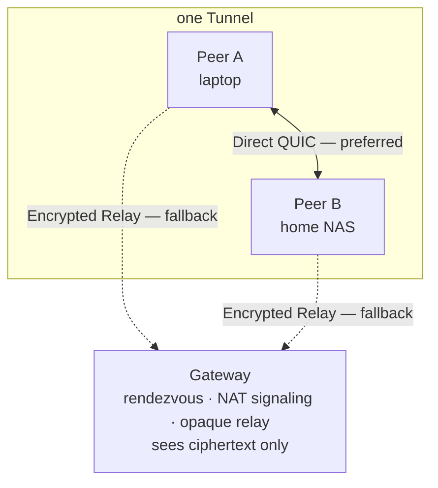

<h1 align="center">Lantunnel</h1>

<p align="center">
  <strong>Your private network, wherever you work.</strong><br>
  Reach the machines and services on your own LANs from anywhere — peer-to-peer first,
  end-to-end encrypted, no port forwarding, no public URLs.
</p>

<p align="center">
  <a href="https://github.com/lantunnel/lantunnel/actions/workflows/ci.yml"></a>
  <a href="https://lantunnel.app/"></a>
  <a href="./LICENSE"></a>
  
  
</p>

<p align="center">
  <a href="https://lantunnel.app/">Website</a> ·
  <a href="https://lantunnel.app/download">Download</a> ·
  <a href="./docs/USAGE.md">Usage guide</a> ·
  <a href="./CONTEXT.md">Architecture</a> ·
  <a href="./docs/PROTOCOL.md">Wire protocol</a>
</p>

<p align="center">
  <b>English</b> ·
  <a href="./README.zh-CN.md">简体中文</a> ·
  <a href="./README.zh-TW.md">繁體中文</a> ·
  <a href="./README.ja.md">日本語</a> ·
  <a href="./README.es.md">Español</a> ·
  <a href="./README.de.md">Deutsch</a> ·
  <a href="./README.fr.md">Français</a>
</p>

---

Your NAS is at home. Your GPU box is in the office. Your `ollama` instance is on the
desktop you left behind. All of them are behind NAT, and none of them should be on the
public internet.

Lantunnel puts those machines into one small private mesh — a **Tunnel** — that only the
people you hand a profile to can join. Peers find each other and talk **directly** when the
network allows it. When it does not, they fall back to an **encrypted relay** through a
Gateway that carries ciphertext it cannot read. Either way nothing is published, no router
port is opened, and no traffic is decrypted in the middle.

> ### 🚀 Don't want to run a Gateway? You don't have to.
>
> **[lantunnel.app](https://lantunnel.app/)** gives every account one **permanent Free
> Tunnel** — unlimited direct peer-to-peer traffic, unlimited LAN devices behind each
> Client, and 5 GB/month of encrypted relay fallback for when direct fails. Create a
> Tunnel, download the Client, import your profile, done. No server, no certificates,
> no DNS.
>
> And if you'd rather host the Gateway yourself, that path is in this repository, it is
> Apache-2.0, and it is not metered at all.
>
> **[→ Create your free Tunnel](https://lantunnel.app/)**

---

## What you get

| | |
|---|---|
| **Direct-first** | New flows try a direct peer-to-peer QUIC path with UDP hole punching. Relay is the fallback, not the default. |
| **End-to-end encrypted** | Relayed payloads are sealed with XChaCha20-Poly1305 under keys from an X25519 exchange between the two Peers. The Gateway relays bytes it cannot decrypt. |
| **No port forwarding** | Peers dial out. Nothing on your LAN needs an inbound rule, a public IP, or a hostname. |
| **Whole-LAN reach** | A Peer can export the private subnets it sits on, so one Client on the network makes the NAS, the printer, and the dashboard reachable to the rest of the Tunnel. |
| **You own the ACL** | Each Client decides what it will serve. Access policy lives on the target machine — never on the Gateway, never on a server. |
| **One binary, UI or headless** | `lantunnel-client` opens a desktop window by default and runs the exact same runtime under `--headless` on a server. |
| **Everywhere** | macOS, Windows, Linux, Android, and iOS. |

### Things people actually use it for

- **Game and media streaming** — Sunshine/Moonlight, Jellyfin, Plex from the machine at home.
- **Private AI and dev tools** — Ollama, Open WebUI, an internal API, a staging box, a database that must never leave the LAN.
- **Home and office services** — NAS, Home Assistant, cameras, internal dashboards, SSH.

## How it works



Three pieces, and that is the whole system:

- **`lantunnel-client`** runs on every device that joins. It imports one signed `.peer`
  profile, attaches to the Gateway, and exposes a loopback SOCKS5 proxy plus optional
  native routes so ordinary apps reach the Tunnel without knowing it exists.
- **`lantunnel-gateway`** is a rendezvous point and NAT-traversal signaler. It admits a
  Tunnel by holding its public `.scope` file, helps Peers punch a direct path, and relays
  sealed bytes when they cannot. It never holds Peer private keys and never sees plaintext.
- **`lantunnel-admin`** creates the Tunnel offline. Two commands: `init-tunnel` makes the
  owner file and the Gateway's public scope, `add-peer` issues one signed profile per
  device. It talks to nothing.

Identity is signed, not shared. There is no Tunnel password, no group secret, and no
bearer token — every Peer holds its own Ed25519 key, proves possession of it on every
attachment, and that key never leaves the machine that generated it.

📖 **[Architecture and concepts →](./CONTEXT.md)**  ·  📐 **[Wire protocol →](./docs/PROTOCOL.md)**

## Quick start

### The fast way — hosted Gateway

1. Create your free Tunnel at **[lantunnel.app](https://lantunnel.app/)**.
2. Add a Peer for each device and download its `.peer` profile.
3. Install the Client from **[lantunnel.app/download](https://lantunnel.app/download)** and
   import the profile.

That's it. Point an app at `127.0.0.1:1080`, or turn on native routing and use the LAN
addresses directly.

### The self-hosted way — your Gateway, your rules

```bash
# 1. Create the Tunnel offline. Nothing here touches the network.
lantunnel-admin init-tunnel \
  --gateway-transport quic \
  --gateway-host gw.example.com \
  --gateway-port 8443
#   → <tunnel-id>.tunnel   keep this secret, it is the Tunnel's signing key
#   → <tunnel-id>.scope    public, this is all the Gateway ever needs

# 2. Issue one profile per device.
lantunnel-admin add-peer --tunnel <tunnel-id>.tunnel --name laptop --output laptop.peer
lantunnel-admin add-peer --tunnel <tunnel-id>.tunnel --name nas    --output nas.peer

# 3. Install the public scope on the Gateway host and run it.
mkdir -p state/scopes.d && cp <tunnel-id>.scope state/scopes.d/
lantunnel-gateway --config configs/gateway.yaml

# 4. On each device, import its own profile and connect.
lantunnel-client tunnel import ./laptop.peer
lantunnel-client                          # desktop UI
lantunnel-client connect '<tunnel_id>'    # same runtime, no window
```

One profile per device — a `.peer` is not meant to be copied around.

📘 **[Full usage guide — installation, LAN exports, access rules, servers, mobile, troubleshooting →](./docs/USAGE.md)**

## What's in this repository

Everything needed to run Lantunnel yourself, under Apache-2.0:

| Path | What it is |
|---|---|
| `apps/lantunnel-client` | The Client. Tauri desktop UI + the headless runtime, one binary. |
| `apps/lantunnel-gateway` | The Gateway. |
| `apps/lantunnel-admin` | Offline provisioning: `init-tunnel`, `add-peer`. |
| `apps/android-proxy` | Android app (VpnService). |
| `apps/ios-proxy` | iOS app (NetworkExtension). |
| `crates/tp-*` | Shared implementation — protocol, transports, proxies, P2P, gateway and client engines. |
| `docs/PROTOCOL.md` | Normative wire format. |
| `CONTEXT.md` | Architecture and vocabulary. |
| `docs/USAGE.md` | How to actually use it. |

The hosted Lantunnel Platform at lantunnel.app — accounts, billing, managed Gateway fleet
— is a separate closed-source service and is **not** in this repository. Nothing here
depends on it. A self-hosted deployment never contacts it.

## Building from source

Requires Rust 1.89+, `protoc` for the gRPC transport, and Node for the Client frontend.

```bash
# Gateway and provisioning tool
cargo build --release -p lantunnel-gateway
cargo build --release -p lantunnel-admin

# Client (build the frontend first)
npm --prefix apps/lantunnel-client/frontend ci
npm --prefix apps/lantunnel-client/frontend run build
cargo build --release -p lantunnel-client
```

On Linux the Client links against webkit2gtk, appindicator, and rsvg; see
[`.github/workflows/ci.yml`](./.github/workflows/ci.yml) for the exact `-dev` packages.

Checks, and a three-Peer end-to-end acceptance that proves every directed TCP and UDP pair
over Direct and then again over Encrypted Relay:

```bash
cargo fmt --all -- --check
cargo clippy --workspace --all-targets -- -D warnings
cargo test --workspace
tests/e2e/v2_docker/run.sh
```

## Compatibility

Peers, Gateways, and profiles must come from the same 2.0.x line — the wire format is not
negotiated across versions. Coming from a 1.x install? Its profiles cannot be imported;
create new ones with `lantunnel-admin`.

## Contributing

Issues and pull requests are welcome — see [CONTRIBUTING.md](./CONTRIBUTING.md) for build,
test, and style guidance. Found a vulnerability? Please report it privately per
[SECURITY.md](./SECURITY.md) rather than in a public issue.

## License

Apache License 2.0 — see [LICENSE](./LICENSE) and [NOTICE](./NOTICE).

---

<p align="center">
  <strong>Skip the setup.</strong> One permanent free Tunnel, unlimited direct traffic,
  managed Gateways on standby.<br>
  <a href="https://lantunnel.app/"><strong>Get started at lantunnel.app →</strong></a>
</p>
