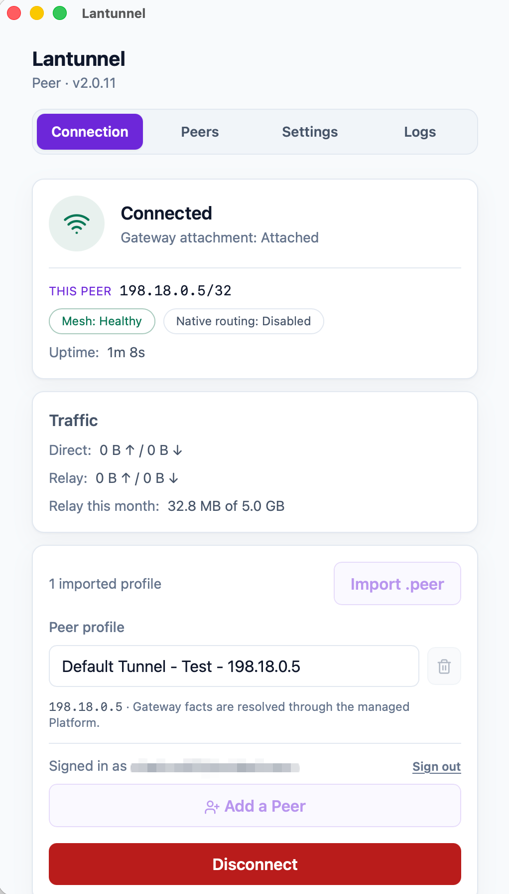
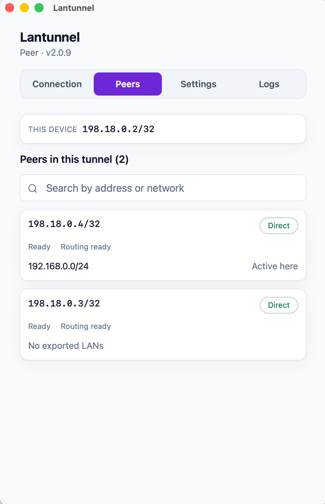
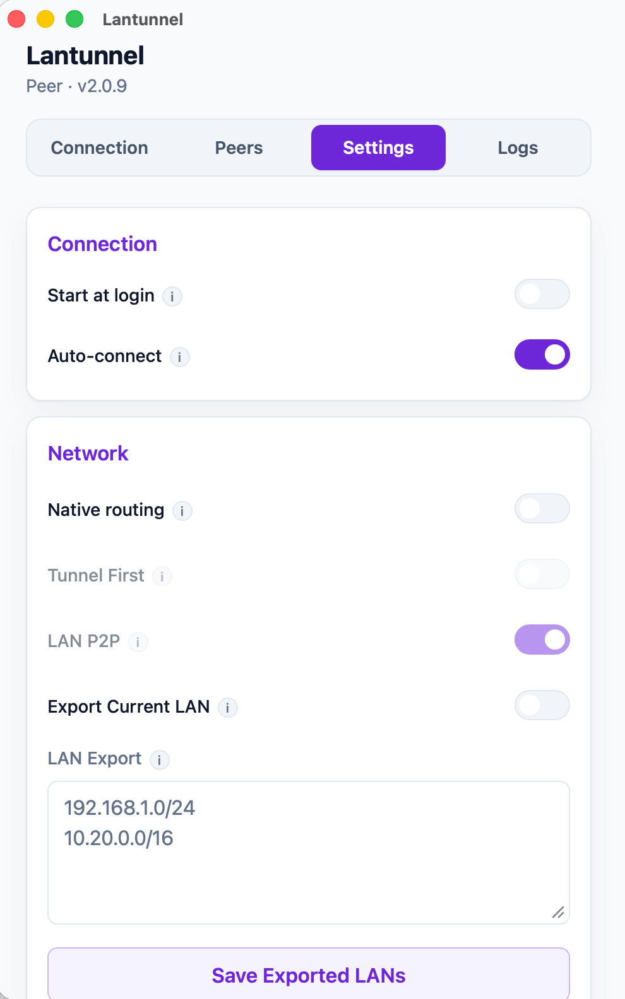
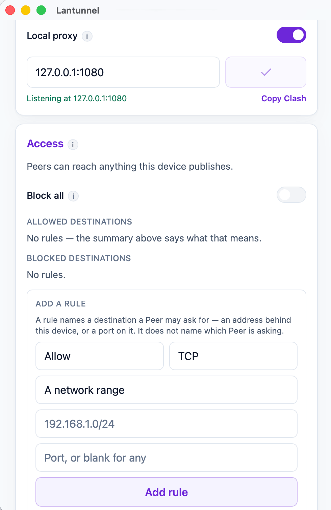
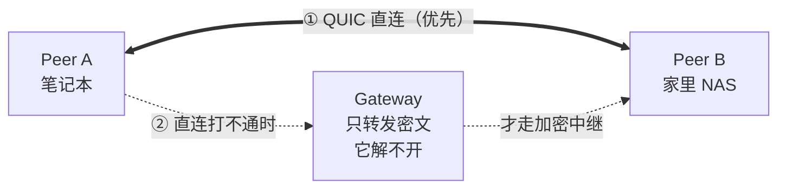

<h1 align="center">Lantunnel</h1>

<p align="center">
  <strong>把你的私有网络随身带走。</strong><br>
  在任何地方访问自己内网里的机器和服务 —— 优先点对点直连，端到端加密，
  不用做端口映射，也不用把任何东西挂到公网。
</p>

<p align="center">
  <a href="https://github.com/lantunnel/lantunnel/actions/workflows/ci.yml"></a>
  <a href="https://lantunnel.app/"></a>
  <a href="./LICENSE"></a>
  
  
</p>

<p align="center">
  <a href="https://qm.qq.com/q/A5LX4uUwzC"></a>
  <a href="https://discord.gg/HsQK9cj2kh"></a>
</p>

<p align="center">
  <a href="https://buymeacoffee.com/buhuipao"></a>
</p>

<p align="center">
  <a href="https://lantunnel.app/">官网</a> ·
  <a href="https://lantunnel.app/download">下载</a> ·
  <a href="./docs/USAGE.zh-CN.md">使用指南</a> ·
  <a href="./CONTEXT.md">架构文档</a> ·
  <a href="./docs/PROTOCOL.md">协议规范</a>
</p>

<p align="center">
  <a href="./README.md">English</a> ·
  <b>简体中文</b> ·
  <a href="./README.zh-TW.md">繁體中文</a> ·
  <a href="./README.ja.md">日本語</a> ·
  <a href="./README.es.md">Español</a> ·
  <a href="./README.de.md">Deutsch</a> ·
  <a href="./README.fr.md">Français</a>
</p>

---

NAS 在家里。跑模型的那台机器在公司。`ollama` 装在你出门时留在桌上的台式机里。它们全都躲在 NAT 后面，而且一台都不该暴露到公网上。

Lantunnel 把这些机器组成一个小小的私有网络 —— 一条 **Tunnel** —— 只有拿到你签发的配置文件的人才进得来。网络条件允许时，各个节点之间**直连**；直连打不通，就退回到经过 Gateway 的**加密中继**，而 Gateway 转发的是它自己也解不开的密文。两条路都一样：什么都不用对外发布，路由器上不用开一个端口，中间也没有任何一环能看到明文。

> ### 🚀 不想自己搭 Gateway？那就别搭。
>
> **[lantunnel.app](https://lantunnel.app/)** 给每个账号一条**永久免费的 Tunnel** —— 点对点流量不限量，每个 Client 后面挂多少台内网设备都不限，另外每月 5 GB 的加密中继额度，留给直连打不通的时候用。建一条 Tunnel、下载 Client、导入配置文件，完事。不用服务器，不用证书，不用配 DNS。
>
> 想自己托管 Gateway 也行 —— 全套代码就在这个仓库里，Apache-2.0 协议，而且完全不计量。
>
> **[→ 领取你的免费 Tunnel](https://lantunnel.app/)**

---

<!-- lantunnel:toc -->
<a id="contents"></a>
## 目录

**第一次来？** 直接看 [快速上手](#quick-start)。那里按上手难度从低到高列了四种玩法 —— 最简单的那种只有三步，不用你准备任何服务器。

- [客户端长这样](#the-client) —— 界面是什么样
- [快速上手](#quick-start) —— **从这里开始**
  - [1. 用平台的 Gateway](#mode-1) —— *最省事，什么都不用部署*
  - [2. 自己的 Gateway，交给平台托管](#mode-2)
  - [3. 全部自己来](#mode-3)
  - [4. 加入别人的 Tunnel](#mode-4)
- [它能给你什么](#what-you-get) · [大家实际拿它做什么](#use-cases)
- [工作原理](#how-it-works) —— 三个部件，以及为什么直连优先
- [仓库里有什么](#whats-inside)
- [从源码构建](#building) · [版本兼容性](#compatibility)
- [相关项目](#related) · [参与贡献](#contributing) · [许可证](#license)

**想看得更深：** [完整使用指南](./docs/USAGE.zh-CN.md) · [架构与术语](./CONTEXT.md) · [线路协议](./docs/PROTOCOL.md)

---

<a id="the-client"></a>
## 客户端长这样

<table>
  <tr>
    <td width="25%" align="center" valign="top"><br><sub><b>连接</b><br>连接状态、本机 Overlay IP，以及直连和中继各走了多少字节。</sub></td>
    <td width="25%" align="center" valign="top"><br><sub><b>Peers</b><br>Tunnel 里的每个 Peer、它的 Overlay IP，以及当前走的路径。</sub></td>
    <td width="25%" align="center" valign="top"><br><sub><b>设置</b><br>开机自启、原生路由、内网导出。</sub></td>
    <td width="25%" align="center" valign="top"><br><sub><b>访问</b><br>本地回环 SOCKS5 监听，以及这台设备愿意提供什么。</sub></td>
  </tr>
</table>

<a id="what-you-get"></a>
## 它能给你什么

| | |
|---|---|
| **直连优先** | 新连接先尝试点对点 QUIC 直连，配合 UDP 打洞。中继是兜底方案，不是默认路径。 |
| **端到端加密** | 中继流量用 XChaCha20-Poly1305 封装，密钥来自两个 Peer 之间的 X25519 协商。Gateway 转发的是它解不开的字节。 |
| **不用端口映射** | 所有 Peer 都是主动往外拨号。你内网里的任何东西都不需要入站规则、公网 IP 或者域名。 |
| **整个内网都能访问** | 一个 Peer 可以把自己所在的私有网段发布出去 —— 网络里放一个 Client，NAS、打印机、监控面板就都能被 Tunnel 里的其他人访问到。 |
| **访问控制权在你手上** | 每个 Client 自己决定对外提供什么。策略存在被访问的那台机器上 —— 不在 Gateway 上，也不在任何服务器上。 |
| **一个程序，带界面或不带** | `lantunnel-client` 默认打开桌面窗口，加上 `--headless` 就是同一套运行时，跑在服务器上。 |
| **平台齐全** | macOS、Windows、Linux、Android、iOS。 |

<a id="use-cases"></a>
### 大家实际拿它做什么

- **游戏和影音串流** —— 访问家里那台机器上的 Sunshine/Moonlight、Jellyfin、Plex。
- **私有 AI 和开发工具** —— Ollama、Open WebUI、内部 API、测试环境、绝对不能出内网的数据库。
- **家庭和办公服务** —— NAS、Home Assistant、摄像头、内部看板、SSH。

<a id="how-it-works"></a>
## 工作原理



整个系统就三个部分：

- **`lantunnel-client`** 装在每台加入的设备上。导入一份签名过的 `.peer` 配置文件，连上 Gateway，然后在本地开一个 SOCKS5 代理，也可以选择安装系统路由 —— 这样普通程序不用知道 Lantunnel 的存在就能访问到 Tunnel。
- **`lantunnel-gateway`** 是会合点和 NAT 穿透的信令方。它靠一份公开的 `.scope` 文件来放行某条 Tunnel，帮两个 Peer 打通直连，打不通就转发封装好的字节。它不持有任何 Peer 私钥，也看不到明文。
- **`lantunnel-admin`** 离线创建 Tunnel。两条命令：`init-tunnel` 生成 owner 文件和给 Gateway 用的公开 scope，`add-peer` 给每台设备签发一份配置。它不联网。

身份靠签名，不靠共享密码。没有 Tunnel 密码，没有群组密钥，也没有 bearer token —— 每个 Peer 持有自己的 Ed25519 私钥，每次接入都要证明自己拥有它，而这把私钥永远不离开生成它的那台机器。

📖 **[架构与概念 →](./CONTEXT.md)**  ·  📐 **[线格式规范 →](./docs/PROTOCOL.md)**

<!-- lantunnel:modes -->
<a id="quick-start"></a>
## 快速上手

四种玩法，按你要动手的多少从少到多排。**大多数人要的是第一种** —— 不用服务器、不用证书、不用配 DNS。

| | 你要跑什么 | 你需要什么 | 花多少钱 |
|---|---|---|---|
| **1. [平台的 Gateway](#mode-1)** | 只跑 Client | 一个账号 | 免费 Tunnel，直连不限量，每月 5 GB 中继 |
| **2. [自己的 Gateway，平台托管](#mode-2)** | Client 加一台 Gateway 主机 | 账号，外加一台有公网地址的机器 | 付费套餐；你自己的中继不计量 |
| **3. [全部自己来](#mode-3)** | 三个部件全都自己跑 | 一台有公网地址的机器 | 免费，Apache-2.0，不用账号，永不联系平台 |
| **4. [别人的 Tunnel](#mode-4)** | 只跑 Client | 对方发给你的一个 `.peer` 文件 | 看对方怎么跑 |

<a id="mode-1"></a>
### 1. 用平台的 Gateway —— *最省事*

什么都不用部署。平台替你跑 Gateway 集群，你只跑 Client。

1. **装上 Client** —— [lantunnel.app/download](https://lantunnel.app/download)。
2. **登录** —— 在连接页点「Sign in」。Client 会打开你的浏览器，你核对并批准它显示的那串码，就登录好了。不用下载任何文件。
3. **加一个 Peer** —— 点「Add a Peer」，选好 Tunnel，给这台设备起个名字。Client 会一步建好 Peer 并导入进来。
4. **连接。**

每台想加进 Tunnel 的设备都重复一遍。然后把程序的代理指到 `127.0.0.1:1080`，或者打开系统路由直接用内网地址访问。

<details>
<summary>更习惯在浏览器里操作？或者要从手机加入？</summary>

到 [lantunnel.app](https://lantunnel.app/) 建好 Peer，下载它的 `.peer` 文件，在 Client 里用「Import .peer」导入。Android 和 iOS 上扫这份配置的二维码同样能导入。
</details>

<a id="mode-2"></a>
### 2. 自己的 Gateway，交给平台托管

流量走你自己的机器，所以中继不算在你头上；账号、Tunnel 签名密钥和 Peer 签发仍然由平台负责。用一份一次性的配对文件把 Gateway 注册一次，之后它保持向外的长连接 —— 平台这边不用开入站端口，也没有需要你手动续期的证书。

**[→ 平台托管 Gateway 安装指南](https://lantunnel.app/docs/installation#platform-connected)**  ·  [仓库里的同一套步骤](./docs/USAGE.zh-CN.md#managed-onboarding)

<a id="mode-3"></a>
### 3. 全部自己来

不用账号，不碰平台，什么都不外联。用 `lantunnel-admin` 离线创建 Tunnel，给每台设备签发一份 `.peer`，再在一台有公网地址的主机上跑 `lantunnel-gateway`。需要的东西全在这个仓库里，Apache-2.0 协议。

**[→ 完整自托管流程](./docs/USAGE.zh-CN.md#self-hosted)**

<a id="mode-4"></a>
### 4. 加入别人的 Tunnel

什么都不用搭。Tunnel 的主人给你签发一份 `.peer` 配置，通过私密渠道发给你；你装上 Client 导入即可。对方的 Gateway 是自建的还是平台的，对你来说没区别。

1. 从 [lantunnel.app/download](https://lantunnel.app/download) 装上 Client。
2. **Import .peer** —— 手机上也可以扫二维码。
3. **连接。**

> 一台设备一份配置。`.peer` 里带着这台设备的私钥，不是拿来到处复制的 —— 找对方要一份你自己的，别去共用别人的。

📘 **[完整使用指南 —— 安装、内网发布、访问规则、服务器部署、手机端、故障排查 →](./docs/USAGE.zh-CN.md)**

<a id="whats-inside"></a>
## 仓库里有什么

自己跑起 Lantunnel 所需的一切，全部 Apache-2.0：

| 路径 | 内容 |
|---|---|
| `apps/lantunnel-client` | Client。Tauri 桌面界面 + headless 运行时，同一个二进制。 |
| `apps/lantunnel-gateway` | Gateway。 |
| `apps/lantunnel-admin` | 离线签发工具：`init-tunnel`、`add-peer`。 |
| `apps/android-proxy` | Android 应用（VpnService）。 |
| `apps/ios-proxy` | iOS 应用（NetworkExtension）。 |
| `crates/tp-*` | 共享实现 —— 协议、传输层、代理、P2P、Gateway 与 Client 引擎。 |
| `docs/PROTOCOL.md` | 线格式规范（规范性文档）。 |
| `CONTEXT.md` | 架构与术语。 |
| `docs/USAGE.zh-CN.md` | 怎么用。 |

lantunnel.app 上的托管平台 —— 账号、计费、托管 Gateway 集群 —— 是一个独立的闭源服务，**不在**这个仓库里。这里的代码不依赖它。自托管部署全程不会联系它。

<a id="building"></a>
## 从源码构建

需要 Rust 1.89+、`protoc`（gRPC 传输用）、Node（构建 Client 前端）。

```bash
# Gateway 和签发工具
cargo build --release -p lantunnel-gateway
cargo build --release -p lantunnel-admin

# Client（先构建前端）
npm --prefix apps/lantunnel-client/frontend ci
npm --prefix apps/lantunnel-client/frontend run build
cargo build --release -p lantunnel-client
```

Linux 上 Client 会链接 webkit2gtk、appindicator 和 rsvg；具体要装哪些 `-dev` 包见 [`.github/workflows/ci.yml`](./.github/workflows/ci.yml)。

检查项，以及一套三 Peer 端到端验收 —— 它会先走直连、再走加密中继，把每个方向的 TCP 和 UDP 组合各验一遍：

```bash
cargo fmt --all -- --check
cargo clippy --workspace --all-targets -- -D warnings
cargo test --workspace
tests/e2e/v2_docker/run.sh
```

<a id="compatibility"></a>
## 版本兼容性

Peer、Gateway 和配置文件必须来自同一条 2.0.x 线 —— 线格式不做跨版本协商。从 1.x 升上来？旧的配置文件导不进来，用 `lantunnel-admin` 重新签发。

<a id="related"></a>
## 相关项目

在 NAT 后面访问自己的机器，是一个热闹又友善的领域。Lantunnel 走的是 P2P 优先、端到端加密这条路；下面这些项目用不同的方式解决相邻的问题，其中不少还能和 Lantunnel 配合使用。

### P2P 与 Mesh 组网

和 Lantunnel 目标一致 —— 把自己的机器放进一张私有网络，而不是把它们暴露到公网。

- [Tailscale](https://github.com/tailscale/tailscale) —— 基于 WireGuard 的 mesh 组网；客户端开源，协调服务器闭源。
- [headscale](https://github.com/juanfont/headscale) —— Tailscale 控制服务器的自托管开源实现。
- [ZeroTier](https://github.com/zerotier/ZeroTierOne) —— 带全球根节点的二层覆盖网络，C++ 实现。
- [Nebula](https://github.com/slackhq/nebula) —— Slack 出品的基于证书的 P2P 覆盖网络；不用 WireGuard，数据面不经中心节点。
- [NetBird](https://github.com/netbirdio/netbird) —— 带 SSO、MFA 和细粒度访问策略的 WireGuard 覆盖网，可托管也可自建。
- [Netmaker](https://github.com/gravitl/netmaker) —— 跑内核态 WireGuard 的 mesh，自带自托管服务端和管理后台。
- [EasyTier](https://github.com/EasyTier/EasyTier) —— Rust 写的去中心化 mesh VPN，支持 NAT 穿透、子网代理和 Web 控制台。
- [innernet](https://github.com/tonarino/innernet) —— 小巧的 Rust WireGuard 组网，用 CIDR 而不是零散 ACL 来表达访问权限。
- [iroh](https://github.com/n0-computer/iroh) —— Rust 库，给你自己的应用加上 QUIC 和 NAT 穿透，用公钥直接拨号对端。
- [MeshLAN](https://github.com/zhaoxuya520/MeshLAN) —— 基于 Nebula 的自托管 P2P 优先虚拟局域网，支持服务共享与多中继。

### 中继与反向代理隧道

应对 NAT 的另一条路：中间放一台公网服务器，把流量转发进你的局域网。当你要把一个 URL 或端口交给一个永远不会装客户端的人时，这条路更合适。

- [frp](https://github.com/fatedier/frp) —— 把 NAT 后的服务暴露出去的标杆反向代理，也是下面多数工具驱动的引擎。
- [MoonProxy](https://github.com/MoonProxyHQ/moonproxy-desktop) —— 免费开源（MIT）的 frp 桌面图形客户端，基于 Tauri v2 + Rust + Vue 3，提供可视化代理规则、实时流量监控，以及 Windows / macOS 上一键启停 frpc。
- [rathole](https://github.com/rathole-org/rathole) —— 轻量、高性能的 Rust NAT 穿透反向代理。
- [frp-panel](https://github.com/VaalaCat/frp-panel) —— 管理 frp 服务端与客户端的多节点 Web 控制面板。
- [chisel](https://github.com/jpillora/chisel) —— 跑在 HTTP 上的快速 TCP/UDP 隧道，单个 Go 二进制。
- [bore](https://github.com/ekzhang/bore) —— 极简的 Rust CLI，通过公网中继暴露一个本地端口。
- [zrok](https://github.com/openziti/zrok) —— 构建在 OpenZiti 之上的分享工具；可公开可私有，可临时可长期。
- [sish](https://github.com/antoniomika/sish) —— 仅靠 SSH 打通到本地的 HTTP/WS/TCP 隧道，客户端什么都不用装。
- [p2ptunnel](https://github.com/chenjia404/p2ptunnel) —— P2P 的 TCP/UDP 内网穿透隧道，直连打通，不需要中继服务器。
- [umbra](https://github.com/chenow9/umbra) —— 自托管的 NAT 后服务 TCP/UDP 网关，支持源 IP 授权和基于票据的访客隧道。

### 清单与横向对比

- [awesome-tunneling](https://github.com/anderspitman/awesome-tunneling) —— 隧道与覆盖网络方案的权威清单，自托管和商业方案都收。

维护着本该出现在这里的项目？欢迎提 issue，我们很乐意加上。

<a id="contributing"></a>
## 参与贡献

欢迎提 issue 和 PR —— 构建、测试和代码风格见 [CONTRIBUTING.md](./CONTRIBUTING.md)。发现安全漏洞？请按 [SECURITY.md](./SECURITY.md) 走私密上报，不要开公开 issue。

<a id="license"></a>
## 许可证

Apache License 2.0 —— 见 [LICENSE](./LICENSE) 和 [NOTICE](./NOTICE)。

---

> 本文是英文 [README.md](./README.md) 的中文版。两者出现分歧时，以英文版为准。

<p align="center">
  <strong>不想折腾？</strong> 一条永久免费 Tunnel，直连流量不限，托管 Gateway 随时待命。<br>
  <a href="https://lantunnel.app/"><strong>到 lantunnel.app 开始 →</strong></a>
</p>
