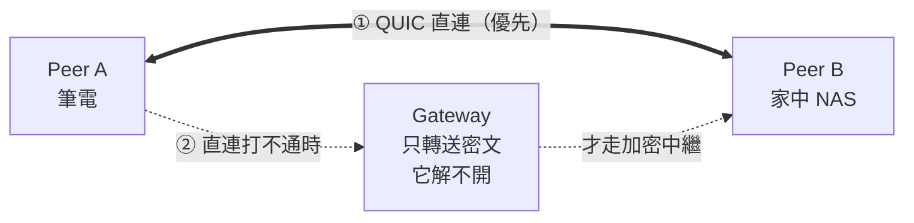

<h1 align="center">Lantunnel</h1>

<p align="center">
  <strong>把你的私有網路隨身帶著走。</strong><br>
  在任何地方連回自己內網裡的機器與服務 —— 優先點對點直連，端到端加密，
  不必做連接埠轉發，也不必把任何東西掛上公網。
</p>

<p align="center">
  <a href="https://github.com/lantunnel/lantunnel/actions/workflows/ci.yml"></a>
  <a href="https://lantunnel.app/"></a>
  <a href="./LICENSE"></a>
  
  
</p>

<p align="center">
  <a href="https://qm.qq.com/q/A5LX4uUwzC"></a>
  <a href="https://discord.gg/HsQK9cj2kh"></a>
</p>

<p align="center">
  <a href="https://buymeacoffee.com/buhuipao"></a>
</p>

<p align="center">
  <a href="https://lantunnel.app/">官方網站</a> ·
  <a href="https://lantunnel.app/download">下載</a> ·
  <a href="./docs/USAGE.zh-TW.md">使用指南</a> ·
  <a href="./CONTEXT.md">架構文件</a> ·
  <a href="./docs/PROTOCOL.md">協定規範</a>
</p>

<p align="center">
  <a href="./README.md">English</a> ·
  <a href="./README.zh-CN.md">简体中文</a> ·
  <b>繁體中文</b> ·
  <a href="./README.ja.md">日本語</a> ·
  <a href="./README.es.md">Español</a> ·
  <a href="./README.de.md">Deutsch</a> ·
  <a href="./README.fr.md">Français</a>
</p>

---

NAS 放在家裡。跑模型的機器在辦公室。`ollama` 裝在你出門時留在桌上的桌機。它們全都躲在 NAT 後面，而且沒有一台該暴露在公開網際網路上。

Lantunnel 把這些機器組成一個小型私有網路 —— 一條 **Tunnel** —— 只有拿到你簽發設定檔的人才進得來。網路條件允許時，節點之間**直連**；直連打不通，就退回經由 Gateway 的**加密中繼**，而 Gateway 轉送的是連它自己都解不開的密文。兩條路徑都一樣：不必對外發布任何東西，路由器上不必開任何連接埠，中途也沒有任何一段看得到明文。

> ### 🚀 不想自己架 Gateway？那就別架。
>
> **[lantunnel.app](https://lantunnel.app/)** 為每個帳號提供一條**永久免費的 Tunnel** —— 點對點流量不限量，每個 Client 後面接多少台內網裝置都不限，另外每月 5 GB 加密中繼額度，留給直連打不通的時候。建立 Tunnel、下載 Client、匯入設定檔，就這樣。不必準備伺服器、憑證或 DNS。
>
> 想自己託管 Gateway 也沒問題 —— 完整程式碼就在這個儲存庫裡，Apache-2.0 授權，而且完全不計量。
>
> **[→ 領取你的免費 Tunnel](https://lantunnel.app/)**

---

<!-- lantunnel:toc -->
<a id="contents"></a>
## 目錄

**第一次來？** 直接看 [快速上手](#quick-start)。那裡按上手難度由低到高列了四種玩法 —— 最簡單的那種只有三步，不用你準備任何伺服器。

- [Client 長這樣](#the-client) —— 介面是什麼樣
- [快速上手](#quick-start) —— **從這裡開始**
  - [1. 用平台的 Gateway](#mode-1) —— *最省事，什麼都不用部署*
  - [2. 自己的 Gateway，交給平台託管](#mode-2)
  - [3. 全部自己來](#mode-3)
  - [4. 自己的 Tunnel，跑在朋友的 Gateway 上](#mode-4)
- [你會得到什麼](#what-you-get) · [大家實際拿它做什麼](#use-cases)
- [運作方式](#how-it-works) —— 三個元件，以及為什麼直連優先
- [儲存庫內容](#whats-inside)
- [從原始碼建置](#building) · [版本相容性](#compatibility)
- [相關專案](#related) · [參與貢獻](#contributing) · [授權](#license)

**想看得更深：** [完整使用指南](./docs/USAGE.zh-TW.md) · [架構與術語](./CONTEXT.md) · [線路協定](./docs/PROTOCOL.md)

---

<a id="the-client"></a>
## Client 長這樣

<table>
  <tr>
    <td width="25%" align="center" valign="top"><br><sub><b>連線</b><br>連線狀態、本機 Overlay IP、直連與中繼各走了多少位元組，以及目前登入的帳號。</sub></td>
    <td width="25%" align="center" valign="top"><br><sub><b>Peers</b><br>Tunnel 裡的每個 Peer、它的 Overlay IP，以及目前走的路徑。</sub></td>
    <td width="25%" align="center" valign="top"><br><sub><b>設定</b><br>開機自動啟動、原生路由、內網匯出。</sub></td>
    <td width="25%" align="center" valign="top"><br><sub><b>存取</b><br>本機回送 SOCKS5 監聽，以及這台裝置願意提供什麼。</sub></td>
  </tr>
</table>

<a id="what-you-get"></a>
## 你會得到什麼

| | |
|---|---|
| **直連優先** | 新連線會先嘗試點對點 QUIC 直連，搭配 UDP 打洞。中繼是備援，不是預設路徑。 |
| **端到端加密** | 中繼流量以 XChaCha20-Poly1305 封裝，金鑰來自兩個 Peer 之間的 X25519 協商。Gateway 轉送的是它解不開的位元組。 |
| **免連接埠轉發** | 所有 Peer 都主動向外撥號。你內網裡的任何東西都不需要輸入規則、公網 IP 或網域名稱。 |
| **整個內網都連得到** | 一個 Peer 可以發布自己所在的私有網段 —— 網路裡放一台 Client，NAS、印表機、內部儀表板就都能被 Tunnel 中的其他人存取。 |
| **存取控制在你手上** | 每個 Client 自行決定對外提供什麼。政策存放在被存取的那台機器上 —— 不在 Gateway，也不在任何伺服器。 |
| **一個程式，有無介面皆可** | `lantunnel-client` 預設開啟桌面視窗，加上 `--headless` 就是同一套執行環境，跑在伺服器上。 |
| **平台齊全** | macOS、Windows、Linux、Android、iOS。 |

<a id="use-cases"></a>
### 大家實際拿它做什麼

- **遊戲與影音串流** —— 連回家中那台機器上的 Sunshine/Moonlight、Jellyfin、Plex。
- **私有 AI 與開發工具** —— Ollama、Open WebUI、內部 API、測試機、絕不能離開內網的資料庫。
- **家庭與辦公服務** —— NAS、Home Assistant、攝影機、內部儀表板、SSH。

<a id="how-it-works"></a>
## 運作方式



整套系統就這三個部分：

- **`lantunnel-client`** 安裝在每台加入的裝置上。匯入一份簽章過的 `.peer` 設定檔，連上 Gateway，然後在本機開一個 SOCKS5 代理，也可以選擇安裝原生路由 —— 這樣一般應用程式不必知道 Lantunnel 存在就能連到 Tunnel。
- **`lantunnel-gateway`** 是會合點與 NAT 穿透的信令方。它靠一份公開的 `.scope` 檔案放行某條 Tunnel，協助兩個 Peer 打通直連，打不通就轉送封裝好的位元組。它不持有任何 Peer 私鑰，也看不到明文。
- **`lantunnel-admin`** 離線建立 Tunnel。兩個指令：`init-tunnel` 產生 owner 檔案與給 Gateway 用的公開 scope，`add-peer` 為每台裝置簽發一份設定檔。它完全不連網。

身分靠簽章，不靠共用密碼。沒有 Tunnel 密碼、沒有群組金鑰、也沒有 bearer token —— 每個 Peer 持有自己的 Ed25519 私鑰，每次接入都要證明自己擁有它，而這把私鑰永遠不離開產生它的那台機器。

📖 **[架構與概念 →](./CONTEXT.md)**  ·  📐 **[線格式規範 →](./docs/PROTOCOL.md)**

<!-- lantunnel:modes -->
<a id="quick-start"></a>
## 快速上手

四種玩法，按你要動手的多寡由少到多排。**大多數人要的是第一種** —— 不用伺服器、不用憑證、不用設定 DNS。

| | 你要跑什麼 | 你需要什麼 | 花多少錢 |
|---|---|---|---|
| **1. [平台的 Gateway](#mode-1)** | 只跑 Client | 一個帳號 | 免費 Tunnel，直連不限量，每月 5 GB 中繼 |
| **2. [自己的 Gateway，平台託管](#mode-2)** | Client 加一台 Gateway 主機 | 帳號，外加一台有公網位址的機器 | 付費方案；你自己的中繼不計量 |
| **3. [全部自己來](#mode-3)** | 三個元件全都自己跑 | 一台有公網位址的機器 | 免費，Apache-2.0，不用帳號，永不連線平台 |
| **4. [自己的 Tunnel，借朋友的 Gateway](#mode-4)** | Client，外加離線跑一次 `lantunnel-admin` | 一個已經在跑 Gateway 的朋友 | 免費；中繼走對方的機器 |

<a id="mode-1"></a>
### 1. 用平台的 Gateway —— *最省事*

什麼都不用部署。平台替你跑 Gateway 叢集，你只跑 Client。

1. **裝上 Client** —— [lantunnel.app/download](https://lantunnel.app/download)。
2. **登入** —— 在連線頁點「Sign in」。Client 會顯示一串短碼並開啟瀏覽器；在網頁上核對並批准這串碼，Client 就會自己登入。什麼都不用下載。
3. **加一個 Peer** —— 點「Add a Peer」，按名稱選好 Tunnel。然後要麼**直接取用這條 Tunnel 已經簽發過的 Peer**，要麼給這台裝置取個名字新建一個。兩種方式都會在同一步裡把設定匯入進來。
4. **連線。**

每台想加進 Tunnel 的裝置都重複一遍。然後把程式的代理指到 `127.0.0.1:1080`，或者開啟系統路由直接用內網位址存取。

> 同一台機器上，優先取用已有的 Peer，而不是再建一個。被你丟下的那個 Peer 仍然留在 Tunnel 裡，還占著它的位址。

<details>
<summary>無介面主機？或者還沒有帳號？</summary>

登入是桌面端和手機端的功能 —— 無介面的 Client 沒有螢幕顯示短碼，所以它走設定檔這條路。到 [lantunnel.app](https://lantunnel.app/) 建好 Peer，下載它的 `.peer`，然後匯入：

```bash
lantunnel-client tunnel import ./nas.peer
```

桌面端用「Import .peer」是同一回事；Android 和 iOS 上掃這份設定的 QR Code 也能匯入。
</details>

<a id="mode-2"></a>
### 2. 自己的 Gateway，交給平台託管

流量走你自己的機器，所以中繼不算在你頭上；帳號、Tunnel 簽章金鑰和 Peer 簽發仍然由平台負責。用一份一次性的配對檔把 Gateway 註冊一次，之後它保持向外的長連線 —— 平台這邊不用開入站埠，也沒有需要你手動續期的憑證。

**[→ 平台託管 Gateway 安裝指南](https://lantunnel.app/docs/installation#platform-connected)**  ·  [儲存庫裡的同一套步驟](./docs/USAGE.zh-TW.md#managed-onboarding)

<a id="mode-3"></a>
### 3. 全部自己來

不用帳號，不碰平台，什麼都不外連。用 `lantunnel-admin` 離線建立 Tunnel，給每台裝置簽發一份 `.peer`，再在一台有公網位址的主機上跑 `lantunnel-gateway`。需要的東西全在這個儲存庫裡，Apache-2.0 授權。

**[→ 完整自行託管流程](./docs/USAGE.zh-TW.md#self-hosted)**

<a id="mode-4"></a>
### 4. 自己的 Tunnel，跑在朋友的 Gateway 上

就是第三種，只是不用自己出伺服器。Tunnel 仍然是你的 —— 你離線建立它，自己簽發 `.peer` —— 朋友那台已經在跑的 Gateway 只負責放行。跟他要傳輸方式、位址、資料埠、mapping 埠，憑證是自簽的話再要一份公開的 `server.crt`：

```bash
lantunnel-admin init-tunnel --gateway-transport quic \
  --gateway-ip <對方的 IP> --gateway-port 8443 --gateway-mapping-port 8444 \
  --gateway-cert ./server.crt --output-dir ./provision

lantunnel-admin add-peer --tunnel ./provision/<tunnel-id>.tunnel \
  --name laptop --output ./provision/laptop.peer
```

傳給他 `<tunnel-id>.scope`，只傳這一個。他把它丟進自己的 `scopes.d` 再 reload 一下就行；一台 Gateway 有幾份 scope 就能放行幾條 Tunnel。

> `.scope` 裡只有 Tunnel ID 和一把簽章公鑰。它只讓對方的 Gateway 放行你的 Peer，別的什麼都給不了：他沒辦法往你的 Tunnel 簽發 Peer，沒辦法把你的 Peer 遷出去，也讀不到你的流量 —— 走中繼的位元組是兩個 Peer 之間封好的。簽發成員身分的 `.tunnel` 始終不離開你自己的機器。

**[→ 共用一台 Gateway 時兩邊各自怎麼做](./docs/USAGE.zh-TW.md#shared-gateway)**

別人從他自己的 Tunnel 簽好一份 `.peer` 傳給你 —— 那不算另一種玩法：裝上 Client，**Import .peer**（手機上掃 QR Code 也行），連線。但一台裝置一份設定：`.peer` 裡帶著這台裝置的私鑰，找對方要一份你自己的，別去共用別人的。

📘 **[完整使用指南 —— 安裝、內網發布、存取規則、伺服器部署、手機端、疑難排解 →](./docs/USAGE.zh-TW.md)**

<a id="whats-inside"></a>
## 儲存庫內容

自行執行 Lantunnel 所需的一切，全部 Apache-2.0：

| 路徑 | 內容 |
|---|---|
| `apps/lantunnel-client` | Client。Tauri 桌面介面 + headless 執行環境，同一個執行檔。 |
| `apps/lantunnel-gateway` | Gateway。 |
| `apps/lantunnel-admin` | 離線簽發工具：`init-tunnel`、`add-peer`。 |
| `apps/android-proxy` | Android 應用程式（VpnService）。 |
| `apps/ios-proxy` | iOS 應用程式（NetworkExtension）。 |
| `crates/tp-*` | 共用實作 —— 協定、傳輸層、代理、P2P、Gateway 與 Client 引擎。 |
| `docs/PROTOCOL.md` | 線格式規範（規範性文件）。 |
| `CONTEXT.md` | 架構與術語。 |
| `docs/USAGE.zh-TW.md` | 怎麼用。 |

lantunnel.app 上的託管平台 —— 帳號、計費、託管 Gateway 叢集 —— 是獨立的閉源服務，**不在**這個儲存庫裡。這裡的程式碼不依賴它。自行託管的部署全程不會連線到它。

<a id="building"></a>
## 從原始碼建置

需要 Rust 1.89+、`protoc`（gRPC 傳輸用）、Node（建置 Client 前端）。

```bash
# Gateway 與簽發工具
cargo build --release -p lantunnel-gateway
cargo build --release -p lantunnel-admin

# Client（先建置前端）
npm --prefix apps/lantunnel-client/frontend ci
npm --prefix apps/lantunnel-client/frontend run build
cargo build --release -p lantunnel-client
```

Linux 上 Client 會連結 webkit2gtk、appindicator 與 rsvg；需要安裝哪些 `-dev` 套件見 [`.github/workflows/ci.yml`](./.github/workflows/ci.yml)。

檢查項目，以及一套三 Peer 端到端驗收 —— 它會先走直連、再走加密中繼，把每個方向的 TCP 與 UDP 組合各驗一次：

```bash
cargo fmt --all -- --check
cargo clippy --workspace --all-targets -- -D warnings
cargo test --workspace
tests/e2e/v2_docker/run.sh
```

<a id="compatibility"></a>
## 版本相容性

Peer、Gateway 與設定檔必須來自同一條 2.0.x 線 —— 線格式不做跨版本協商。從 1.x 升上來？舊的設定檔匯不進來，請用 `lantunnel-admin` 重新簽發。

<a id="related"></a>
## 相關專案

在 NAT 後面存取自己的機器，是一個熱鬧又友善的領域。Lantunnel 走的是 P2P 優先、端到端加密這條路；下面這些專案用不同的方式解決相鄰的問題，其中不少還能和 Lantunnel 搭配使用。

### P2P 與 Mesh 組網

和 Lantunnel 目標一致 —— 把自己的機器放進一張私有網路，而不是把它們暴露到公網。

- [Tailscale](https://github.com/tailscale/tailscale) —— 基於 WireGuard 的 mesh 組網；用戶端開源，協調伺服器閉源。
- [headscale](https://github.com/juanfont/headscale) —— Tailscale 控制伺服器的自架開源實作。
- [ZeroTier](https://github.com/zerotier/ZeroTierOne) —— 帶全球根節點的第二層覆蓋網路，以 C++ 實作。
- [Nebula](https://github.com/slackhq/nebula) —— Slack 出品、以憑證為基礎的 P2P 覆蓋網路；不用 WireGuard，資料面不經中心節點。
- [NetBird](https://github.com/netbirdio/netbird) —— 帶 SSO、MFA 與細緻存取策略的 WireGuard 覆蓋網，可託管也可自架。
- [Netmaker](https://github.com/gravitl/netmaker) —— 跑核心態 WireGuard 的 mesh，自帶自架伺服器與管理後台。
- [EasyTier](https://github.com/EasyTier/EasyTier) —— Rust 寫的去中心化 mesh VPN，支援 NAT 穿透、子網代理與 Web 主控台。
- [innernet](https://github.com/tonarino/innernet) —— 小巧的 Rust WireGuard 組網，用 CIDR 而非零散 ACL 表達存取權限。
- [iroh](https://github.com/n0-computer/iroh) —— Rust 函式庫，為你自己的應用加上 QUIC 與 NAT 穿透，以公鑰直接撥號對端。
- [MeshLAN](https://github.com/zhaoxuya520/MeshLAN) —— 基於 Nebula 的自架 P2P 優先虛擬區域網路，支援服務共享與多中繼。

### 中繼與反向代理隧道

應對 NAT 的另一條路：中間放一台公網伺服器，把流量轉發進你的區域網路。當你要把一個 URL 或連接埠交給一個永遠不會裝用戶端的人時，這條路更合適。

- [frp](https://github.com/fatedier/frp) —— 把 NAT 後的服務暴露出去的標竿反向代理，也是下面多數工具驅動的引擎。
- [MoonProxy](https://github.com/MoonProxyHQ/moonproxy-desktop) —— 免費開源（MIT）的 frp 桌面圖形用戶端，基於 Tauri v2 + Rust + Vue 3，提供視覺化代理規則、即時流量監控，以及 Windows / macOS 上一鍵啟停 frpc。
- [rathole](https://github.com/rathole-org/rathole) —— 輕量、高效能的 Rust NAT 穿透反向代理。
- [frp-panel](https://github.com/VaalaCat/frp-panel) —— 管理 frp 伺服器與用戶端的多節點 Web 控制面板。
- [chisel](https://github.com/jpillora/chisel) —— 跑在 HTTP 上的快速 TCP/UDP 隧道，單一 Go 執行檔。
- [bore](https://github.com/ekzhang/bore) —— 極簡的 Rust CLI，透過公網中繼暴露一個本機連接埠。
- [zrok](https://github.com/openziti/zrok) —— 建構在 OpenZiti 之上的分享工具；可公開可私有，可臨時可長期。
- [sish](https://github.com/antoniomika/sish) —— 僅靠 SSH 打通到本機的 HTTP/WS/TCP 隧道，用戶端什麼都不用裝。
- [p2ptunnel](https://github.com/chenjia404/p2ptunnel) —— P2P 的 TCP/UDP 內網穿透隧道，直連打通，不需要中繼伺服器。
- [umbra](https://github.com/chenow9/umbra) —— 自架的 NAT 後服務 TCP/UDP 閘道，支援來源 IP 授權與票據式訪客隧道。

### 清單與橫向比較

- [awesome-tunneling](https://github.com/anderspitman/awesome-tunneling) —— 隧道與覆蓋網路方案的權威清單，自架與商業方案都收。

維護著本該出現在這裡的專案？歡迎提 issue，我們很樂意加上。

<a id="contributing"></a>
## 參與貢獻

歡迎提出 issue 與 PR —— 建置、測試與程式風格見 [CONTRIBUTING.md](./CONTRIBUTING.md)。發現安全漏洞？請依 [SECURITY.md](./SECURITY.md) 走私密回報，不要開公開 issue。

<a id="license"></a>
## 授權

Apache License 2.0 —— 見 [LICENSE](./LICENSE) 與 [NOTICE](./NOTICE)。

---

> 本文是英文 [README.md](./README.md) 的繁體中文版。兩者出現分歧時，以英文版為準。

<p align="center">
  <strong>不想折騰？</strong> 一條永久免費 Tunnel，直連流量不限，託管 Gateway 隨時待命。<br>
  <a href="https://lantunnel.app/"><strong>前往 lantunnel.app 開始 →</strong></a>
</p>
